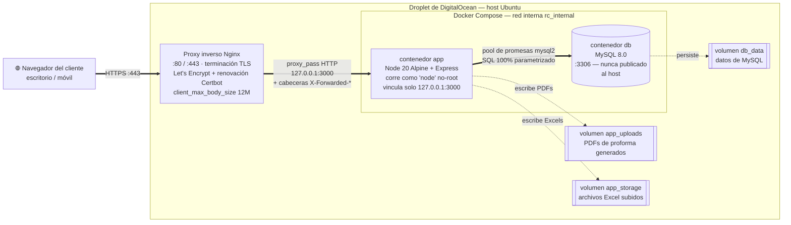
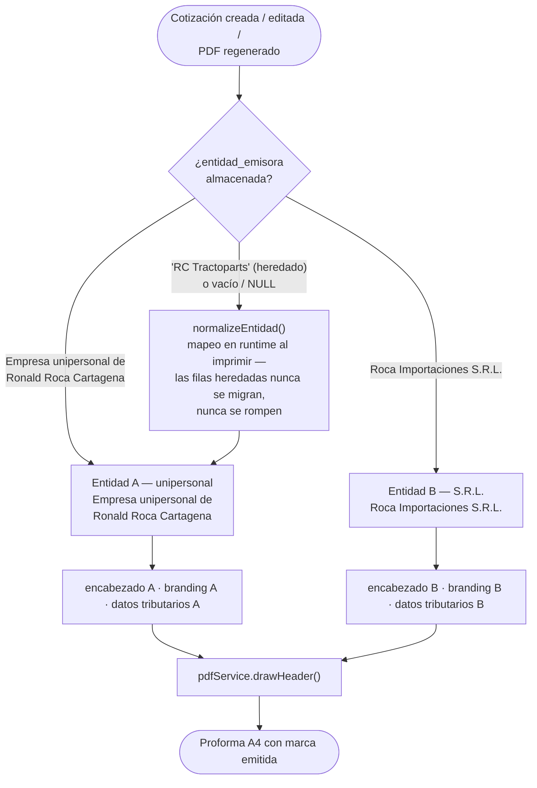
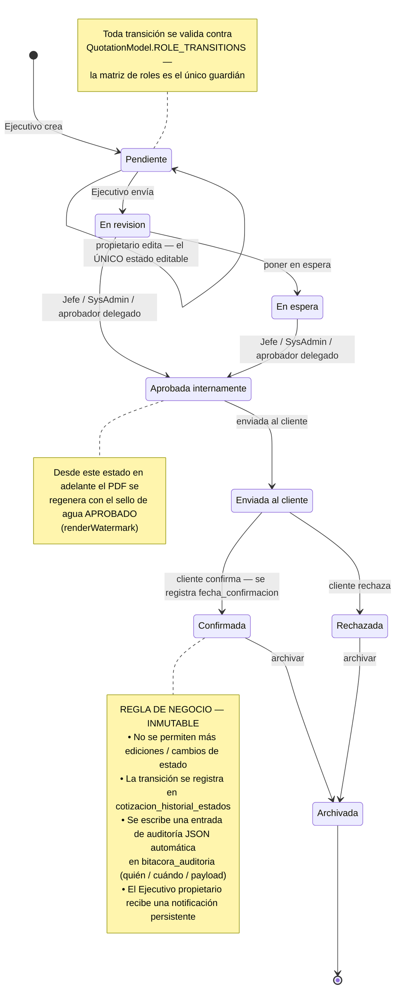
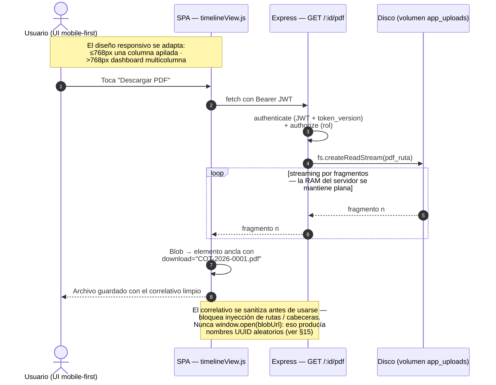
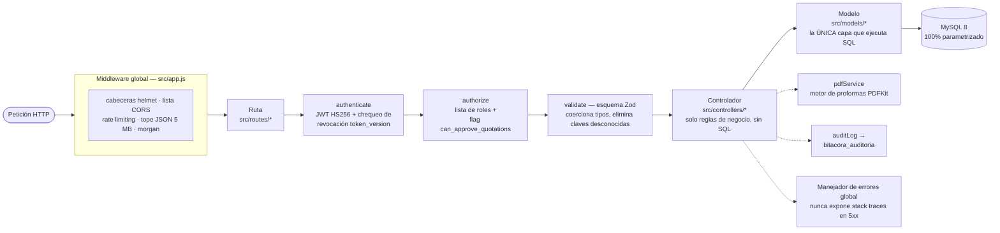
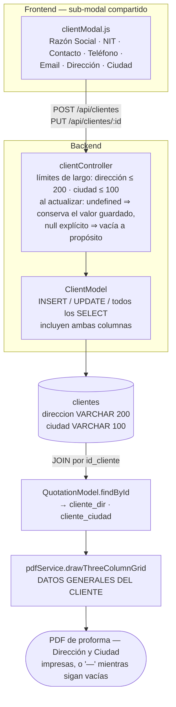
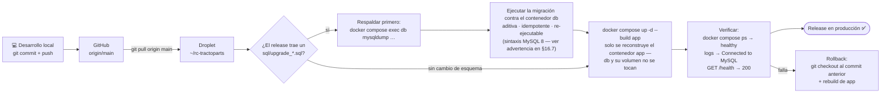

# RC Tractoparts — Sistema de Gestión de Cotizaciones

> 🇺🇸 Prefer reading this in English? → [English README](README.md)


API REST y cliente web liviano para la gestión de **cotizaciones (proformas)** de **Empresa unipersonal de Ronald Roca Cartagena** (anteriormente con la marca "RC Tractoparts") y **Roca Importaciones S.R.L.**, empresa importadora de repuestos para maquinaria pesada en Santa Cruz, Bolivia. El sistema cubre el ciclo de vida completo de una cotización: catálogos de clientes y marcas, generación atómica de correlativos, máquina de estados con aprobación basada en roles, generación de PDFs corporativos multiempresa, carga de archivos (PDF + Excel), notificaciones internas, auditoría y reportes de inteligencia de negocio.

El backend es una API REST en Node.js + Express respaldada por MySQL. El frontend es una aplicación de una sola página (SPA) en JavaScript puro (ES Modules), servida como archivos estáticos por el mismo proceso de Express — sin paso de compilación. Todo el stack está contenedorizado con Docker y orquestado con Docker Compose.

---

## Tabla de Contenidos

1. [Descripción General](#1-descripción-general)
2. [Arquitectura del Sistema y Stack Tecnológico](#2-arquitectura-del-sistema-y-stack-tecnológico)
3. [Diagramas de Arquitectura y Flujo](#3-diagramas-de-arquitectura-y-flujo)
4. [Estructura de Directorios](#4-estructura-de-directorios)
5. [Requisitos Previos](#5-requisitos-previos)
6. [Instalación Local vía Docker](#6-instalación-local-vía-docker)
7. [Instalación Manual (sin Docker)](#7-instalación-manual-sin-docker)
8. [Ejecución Local](#8-ejecución-local)
9. [Variables de Entorno](#9-variables-de-entorno)
10. [Vista Funcional](#10-vista-funcional)
11. [Arquitectura del Frontend](#11-arquitectura-del-frontend)
12. [Modelo de Seguridad](#12-modelo-de-seguridad)
13. [Pruebas](#13-pruebas)
14. [Entidad de Negocio y Nomenclatura Legal](#14-entidad-de-negocio-y-nomenclatura-legal)
15. [Refactorizaciones de PDF y Descargas](#15-refactorizaciones-de-pdf-y-descargas)
16. [Despliegue en Producción (Nginx + DigitalOcean)](#16-despliegue-en-producción-nginx--digitalocean)
17. [Licencia](#licencia)

---

## 1. Descripción General

- **Propósito:** Reemplazar las hojas de cálculo de proformas manuales con un flujo de trabajo controlado y auditado: los ejecutivos construyen cotizaciones, los jefes las aprueban, y el sistema genera un PDF corporativo consistente para el cliente.
- **Empresa:** La entidad emisora principal es **Empresa unipersonal de Ronald Roca Cartagena** (anteriormente con la marca "RC Tractoparts"), permaneciendo **Roca Importaciones S.R.L.** activa como segunda entidad emisora. Importador de repuestos para maquinaria pesada (Volvo, Komatsu, John Deere, JCB, CAT, CASE) con sede en Santa Cruz, Bolivia. Ver [§14 Entidad de Negocio y Nomenclatura Legal](#14-entidad-de-negocio-y-nomenclatura-legal) para el detalle completo del refactor de renombrado y la tolerancia a datos heredados.
- **Usuarios / roles:** `Ejecutivo`, `Administracion`, `Jefe`, `SysAdmin`, más un indicador de delegación por usuario `can_approve_quotations` (Delegación de Funciones).
- **Invariantes clave:** cada cambio de estado es validado por rol y auditado; cada cotización posee exactamente **un** PDF físico (regenerado en cada cambio relevante); todo el SQL es parametrizado; el correlativo se genera atómicamente bajo bloqueo de fila.

---

## 2. Arquitectura del Sistema y Stack Tecnológico

**Arquitectura:** Proceso único de Node.js. `src/server.js` valida la conexión a la BD y luego inicia Express; `src/app.js` construye el grafo de middlewares/rutas y se exporta por separado para que los tests puedan importarlo sin vincular un puerto. El layering es estricto: **rutas → controladores → modelos → MySQL**. Solo los modelos ejecutan SQL.

| Módulo | Tecnología (exacta) |
|---|---|
| Runtime | Node.js `>= 18` (imagen Docker: Node 20 LTS Alpine) |
| Framework web | Express `^4.19.2` |
| Base de datos | MySQL 8 vía `mysql2 ^3.9.7` (promise pool) |
| Autenticación | `jsonwebtoken ^9.0.2` (HS256) + `bcryptjs ^2.4.3` |
| Validación de entrada | `zod ^4.4.3` |
| Generación de PDF | `pdfkit ^0.18.0` |
| Carga de archivos | `multer ^1.4.5-lts.1` |
| Seguridad / CORS / rate-limit | `helmet ^7.1.0`, `cors ^2.8.5`, `express-rate-limit ^8.5.2` |
| Logging HTTP | `morgan ^1.10.0` |
| Documentación de API | `swagger-jsdoc ^6.3.0` + `swagger-ui-express ^5.0.1` |
| Configuración | `dotenv ^16.4.5` |
| Pruebas | `jest ^29.7.0` + `supertest ^7.0.0` |
| Linting | `eslint ^10.5.0` (flat config) |
| Recarga en desarrollo | `nodemon ^3.1.0` |
| Frontend | Vanilla JS (ES Modules), sin build |
| Contenedorización | Docker (multi-stage) + Docker Compose |

**Tablas de base de datos** (`sql/init.sql`): `roles`, `usuarios`, `marcas`, `clientes`, `productos`, `cotizaciones_correlativo`, `cotizaciones`, `cotizacion_detalles`, `auditoria`, `bitacora_auditoria`, `cotizacion_historial_estados`, `notificaciones`.

La columna `cotizaciones.entidad_emisora` (razón social emisora impresa en el encabezado de cada PDF) se almacena como **`VARCHAR(150)`**, con amplio margen para el nombre legal de 44 caracteres `Empresa unipersonal de Ronald Roca Cartagena`.

**Máquina de estados de cotizaciones** (aplicada por rol en `QuotationModel.ROLE_TRANSITIONS`):

```
Pendiente → En revision → En espera → Aprobada internamente → Enviada al cliente → Confirmada / Rechazada → Archivada
```

> **Nota histórica:** el estado de cotización confirmada fue renombrado de `Aceptada` a `Confirmada`. Una migración en `sql/init.sql` reescribe las filas heredadas `Aceptada` (y sus entradas de historial) a `Confirmada`, y el valor se conserva en listas de permitidos tolerantes para que los datos previos al renombrado nunca rompan la validación.

---

## 3. Diagramas de Arquitectura y Flujo

### 3.1 Arquitectura de Despliegue e Infraestructura

Flujo de la petición desde el cliente, sobre HTTPS, a través del proxy inverso Nginx del host (terminación SSL con Let's Encrypt), hacia los contenedores Docker aislados. Ningún contenedor es alcanzable desde internet: la app se vincula solo a loopback y MySQL no se publica en absoluto.



### 3.2 Lógica Dinámica Multiempresa

Cómo el sistema resuelve encabezados, marca (branding) e información tributaria separados a partir de la `entidad_emisora` almacenada en cada cotización — incluyendo el mapeo tolerante en runtime que permite que las filas previas al renombrado (`'RC Tractoparts'`) impriman correctamente **sin ninguna migración de datos**.



### 3.3 Máquina de Estados del Ciclo de Vida del Documento

Flujo completo de la cotización, enfatizando las reglas de negocio del estado **`Confirmada`** — su inmutabilidad absoluta y el disparador automático de registro de auditoría.



### 3.4 Rendimiento del Sistema y Flujo de UI

Transiciones de diseño responsivo mobile-first y la descarga asíncrona y eficiente en memoria del PDF (respuestas por streaming en fragmentos que evitan la saturación de RAM).



### 3.5 Pipeline de Peticiones y Layering Estricto

Toda petición a la API cruza el mismo recorrido antes de que corra cualquier lógica de negocio. El layering es estricto — **solo los modelos ejecutan SQL** — de modo que cada preocupación de seguridad vive en exactamente un lugar.



### 3.6 Slice de Datos del Cliente — Dirección / Ciudad de Punta a Punta

El camino vertical completo que recorre la dirección de un cliente, desde el modal compartido hasta la proforma impresa. Este es el slice completado en §15 — antes de esa corrección el lado de escritura (modal → controlador → modelo) simplemente no existía, por lo que el PDF siempre imprimía `—`.



### 3.7 Flujo de Release y Migraciones de Esquema

Cómo un cambio llega a producción. La regla clave: **las migraciones aditivas de esquema corren contra la BD viva *antes* de construir el código nuevo que depende de ellas** — nunca al revés, y nunca vía `db:init` (que es destructivo).



---

## 4. Estructura de Directorios

```
rc-tractoparts/
├── Dockerfile                     # Build multi-stage (deps → runner, sin root)
├── docker-compose.yml             # app + MySQL + volúmenes + red interna
├── .dockerignore                  # Mantiene secretos/tests/artefactos fuera de la imagen
├── src/
│   ├── server.js                  # Punto de entrada: verificación de BD + HTTP listen + shutdown
│   ├── app.js                     # App Express: middlewares, Swagger, rutas, manejador de errores
│   ├── config/
│   │   └── db.js                  # Pool de conexiones MySQL (singleton) + ping de arranque
│   ├── routes/                    # /api/auth, /api/cotizaciones, /api/usuarios, …
│   ├── controllers/               # Manejadores de peticiones (incl. subcarpeta quotation/)
│   ├── models/                    # ÚNICA capa que ejecuta SQL (todo parametrizado)
│   ├── middlewares/               # authMiddleware, roleMiddleware, auditMiddleware
│   ├── validators/                # Esquemas Zod + factory validate()
│   ├── services/
│   │   └── pdfService.js          # Motor de diseño de proformas con PDFKit
│   ├── realtime/
│   │   └── socketServer.js        # Capa de sockets en tiempo real (candados / eventos en vivo)
│   ├── utils/
│   │   └── auditLog.js
│   └── assets/images/             # rc_logo.png + marcas/*.png (para el motor PDF)
├── public/                        # Frontend estático (servido por Express)
│   ├── index.html                 # Login
│   ├── dashboard.html
│   ├── css/styles.css
│   └── js/{services,views}/        # apiClient, authSession, vistas del dashboard
├── sql/
│   ├── init.sql                   # Fuente única de verdad: esquema + datos iniciales (DESTRUCTIVO)
│   ├── init.js                    # Ejecuta init.sql (conexión admin, multipleStatements)
│   └── upgrade_*.sql              # Migraciones ADITIVAS puntuales para BDs vivas (ver §16.7)
├── scripts/
│   └── seed-users.js              # Genera hashes bcrypt; siembra usuarios de dev/test
├── tests/
│   ├── unit/                      # Sin BD requerida
│   └── integration/               # Requiere la base de datos de prueba
├── uploads/                       # PDFs generados/subidos (gitignored, volumen runtime)
├── storage/excels/                # Hojas Excel subidas (gitignored, volumen runtime)
├── .env.example                   # Referencia de variables de entorno
├── eslint.config.js
└── package.json
```

---

## 5. Requisitos Previos

**Para el flujo con Docker (recomendado):**

- **Docker Engine 24+** y el plugin **Docker Compose v2**.
- No se requiere instalación local de Node.js ni MySQL — ambos corren en contenedores.

**Para el flujo manual:**

- **Node.js `>= 18`** y npm (el lockfile es de npm).
- **MySQL Server 8.x** en ejecución y accesible, con una cuenta que pueda crear bases de datos (para `npm run db:init`).

---

## 6. Instalación Local vía Docker

El repositorio incluye un `Dockerfile` multi-stage orientado a producción y un `docker-compose.yml` que orquesta la aplicación y una base de datos MySQL persistente en una red interna aislada.

```bash
# 1. Clonar y entrar al proyecto
git clone <repo-url> rc-tractoparts && cd rc-tractoparts

# 2. Crear el archivo de entorno desde la plantilla y llenar los secretos reales
cp .env.example .env          # PowerShell: Copy-Item .env.example .env

# 3. Construir las imágenes y levantar el stack (en segundo plano)
docker compose up -d --build

# 4. Seguir los logs de la aplicación
docker compose logs -f app
```

**Qué ocurre en el primer `up`:**

- El servicio `db` inicializa MySQL y **ejecuta automáticamente `sql/init.sql`** (montado en `/docker-entrypoint-initdb.d/`), que elimina/recrea el esquema y siembra roles, marcas, clientes de ejemplo, el contador anual y las cuentas privilegiadas iniciales.
- El servicio `app` espera a que la base de datos reporte estado **saludable** (`depends_on: condition: service_healthy`) y luego inicia Express.
- Los PDFs generados y los archivos Excel subidos persisten en los volúmenes nombrados `app_uploads` y `app_storage`; los datos de la base persisten en `db_data`.

**Endpoints (publicados en el host solo en `127.0.0.1`):**

- Frontend / Login: `http://localhost:3000/`
- Health check: `http://localhost:3000/health`
- Swagger UI: `http://localhost:3000/api-docs`

**Comandos comunes:**

```bash
docker compose ps                 # Estado de los contenedores
docker compose logs -f app        # Ver logs de la app
docker compose exec app sh        # Abrir shell en el contenedor de la app
docker compose exec db mysql -u root -p   # Cliente MySQL dentro del contenedor db
docker compose down               # Detener y eliminar contenedores (se conservan volúmenes)
docker compose down -v            # Detener y ADEMÁS eliminar volúmenes (destruye los datos)
```

> ⚠️ `sql/init.sql` es **destructivo** — en la primera inicialización elimina cualquier base de datos `rc_tractoparts` existente. Solo se ejecuta automáticamente cuando el volumen `db_data` está vacío (primer arranque).

**Cuentas iniciales sembradas por `init.sql`** (cámbialas en producción):

| Usuario | Rol | Contraseña |
|---|---|---|
| `SysAdmin` | SysAdmin (4) | `Admin#RC2026` |
| `ronald` | Jefe (3) | `Ronald#RC2026` |
| `angelica` | Administracion (2) | `Angelica#RC2026` |

Las cuentas `Ejecutivo` **no** se siembran; se crean desde la plataforma mediante `POST /api/usuarios`.

---

## 7. Instalación Manual (sin Docker)

```bash
# 1. Instalar dependencias
npm install

# 2. Crear el archivo de entorno desde la plantilla
cp .env.example .env          # PowerShell: Copy-Item .env.example .env

# 3. Edita .env con tus valores reales (mantén DB_HOST=localhost para MySQL local)

# 4. Inicializar la base de datos (destructivo — elimina rc_tractoparts primero)
npm run db:init

# 5. (Opcional) Sembrar usuarios de desarrollo/test con hashes bcrypt frescos
npm run seed            # SOLO PREVISUALIZACIÓN — imprime el SQL, no escribe nada
npm run seed:execute    # Conecta e inserta/actualiza los usuarios de dev en la BD
```

> `db:init` abre una conexión admin de un solo uso (sin BD preseleccionada, `multipleStatements` activado) y ejecuta el script completo `sql/init.sql`.

---

## 8. Ejecución Local

```bash
# Desarrollo (recarga automática con nodemon)
npm run dev

# Inicio en modo producción
npm start
```

Al iniciar con éxito, el servidor valida la conexión a la BD y luego escucha en `PORT` (por defecto **3000**). Si MySQL no es accesible, el arranque se interrumpe con código de salida no cero.

**Calidad / pruebas:**

```bash
npm run lint              # ESLint sobre src/
npm run test:unit         # Tests unitarios — SIN base de datos requerida
npm run test:integration  # Tests de integración — REQUIERE BD rc_tractoparts_test
npm test                  # Jest completo (integración requiere la BD de test)
```

---

## 9. Variables de Entorno

Todos los secretos y la configuración están externalizados en `.env` (nunca versionado). Referencia (`.env.example`):

| Variable | Grupo | Descripción |
|---|---|---|
| `NODE_ENV` | App | `development` \| `production` \| `test` |
| `PORT` | App | Puerto HTTP en el que escucha Express (por defecto `3000`) |
| `APP_NAME` | App | Nombre mostrado en logs / Swagger |
| `DB_HOST` | Base de datos | Host de MySQL. En Docker Compose se sobrescribe al nombre del servicio `db` |
| `DB_PORT` | Base de datos | Puerto de MySQL (por defecto `3306`) |
| `DB_USER` | Base de datos | Usuario de BD de la aplicación |
| `DB_PASSWORD` | Base de datos | Contraseña del usuario de BD (**secreto**) |
| `DB_NAME` | Base de datos | Nombre de la base principal (`rc_tractoparts`) |
| `DB_NAME_TEST` | Base de datos | Base usada solo cuando `NODE_ENV=test` |
| `DB_ROOT_PASSWORD` | Base de datos | Contraseña **root** de MySQL para el servicio `db` de Compose (**secreto**) |
| `DB_CONNECTION_LIMIT` | Base de datos | Máximo de conexiones simultáneas del pool |
| `DB_QUEUE_LIMIT` | Base de datos | Límite de cola; `0` = ilimitado |
| `JWT_SECRET` | Auth | Secreto de firma HS256, ≥ 64 caracteres aleatorios (**secreto**) |
| `JWT_EXPIRES_IN` | Auth | Duración del token (ej. `8h`) |
| `BCRYPT_ROUNDS` | Auth | Factor de costo de bcrypt |
| `MAX_LOGIN_ATTEMPTS` | Seguridad | Fallos antes del bloqueo de cuenta |
| `LOCK_DURATION_MINUTES` | Seguridad | Duración del bloqueo de cuenta |
| `UPLOAD_DIR` | Cargas | Directorio de subida de PDFs (por defecto `uploads/cotizaciones`) |
| `MAX_PDF_SIZE_MB` | Cargas | Tamaño máximo de PDF en MB |
| `CORS_ORIGIN` | CORS | Orígenes permitidos separados por coma (tu dominio HTTPS público en producción) |

> **Generación de secretos:** crea un JWT secret fuerte con `openssl rand -hex 64`. Nunca escribas secretos en el código fuente, el Dockerfile ni el `docker-compose.yml` — Compose los lee de `.env` en tiempo de ejecución.

---

## 10. Vista Funcional

### Cliente web (servido desde `public/`)

- **Login** (`index.html`) — usuario/contraseña, JWT almacenado en cliente mediante `authSession`.
- **Dashboard** (`dashboard.html`) — vistas ajustadas al rol: lista/filtros de cotizaciones, formulario de cotización, cola de aprobaciones, notificaciones, timeline/historial y reportes BI.

### Superficie de la API REST

| Área | Endpoints | Acceso |
|---|---|---|
| **Auth** | `POST /api/auth/login`, `POST /api/auth/logout` | Público / autenticado |
| **Cotizaciones** | `GET /` (paginado+filtrado), `POST /`, `GET /:id`, `PUT /:id` (propietario, solo Pendiente), `GET /resumen`, `GET /pendientes-aprobacion`, `GET /:id/historial` | Todos los roles autenticados (escritura con restricción de rol) |
| **Estado de cotización** | `PUT /:id/estado` (máquina de estados por rol), `POST /:id/aprobar` (Jefe/SysAdmin), `PATCH /:id/comentario-admin` (Administracion) | Restringido por rol |
| **Archivos de cotización** | `POST /:id/pdf`, `POST /:id/upload` (PDF+Excel), `GET /:id/pdf`, `GET /:id/excel` | Ejecutivo sube / todos descargan |
| **Notificaciones** | `GET /api/cotizaciones/notificaciones`, `POST /…/notificaciones/leer` | Ejecutivo |
| **Usuarios** | `GET /`, `POST /`, `GET /:id`, `PUT /:id` (Jefe/Administracion/SysAdmin), `DELETE /:id` soft-delete (Jefe/SysAdmin) | Roles de gestión |
| **Clientes** | `GET /` (autocompletado, 20 activos), `GET /all` (paginado, incl. inactivos), `GET /:id`, `POST /`, `PUT /:id` (también reactiva vía `activo`), `DELETE /:id` baja lógica | Todos los roles |
| **Marcas** | `GET /api/marcas`, `POST /api/marcas` | Roles que crean cotizaciones |
| **Reportes** | `GET /api/reportes/progreso` (Jefe/SysAdmin), `GET /api/reportes/advanced` (seguridad a nivel de fila para Ejecutivo) | Restringido |
| **Sistema** | `GET /health` | Público |
| **Documentación** | `GET /api-docs` | Público (Swagger UI) |

### Comportamiento transversal

- **Seguridad:** Cabeceras Helmet, lista de CORS configurable, rate limiting global (más estricto en login y subidas), límite de cuerpo JSON de 5 MB, y un manejador de errores global que nunca expone stack traces o internos en respuestas 5xx.
- **Auth y sesiones:** JWT (HS256, 8h por defecto) con nombre de rol y `token_version`; el logout incrementa el contador persistente para que la revocación sobreviva reinicios. Bloqueo por fuerza bruta tras fallos repetidos.
- **Validación:** Esquemas Zod sanitizan y coercionan tipos en cada escritura; las claves desconocidas son eliminadas.
- **Auditoría:** Las acciones significativas se escriben en `bitacora_auditoria` / `auditoria`; las transiciones de estado por cotización se registran en `cotizacion_historial_estados`.
- **Motor PDF:** Genera una proforma corporativa A4 (logo, franja de marcas asociadas, grilla de cliente/solicitante/equipo, tabla de líneas con formato numérico es-BO, monto en palabras, datos bancarios y sello `APROBADO` en cotizaciones aprobadas). Los archivos subidos se validan por número mágico, no solo por tipo MIME declarado.
- **Notificaciones:** Los usuarios `Ejecutivo` reciben notificaciones internas persistentes al cambiar el estado de una cotización; los elementos no leídos permanecen visibles hasta ser explícitamente marcados vía `POST /…/notificaciones/leer`.

---

## 11. Arquitectura del Frontend

El frontend es una SPA en JavaScript puro usando ES Modules — sin transpilador ni bundler. Patrones de diseño aplicados:

**Patrón Strategy** — el renderizado basado en rol se delega a objetos estrategia concretos elegidos al iniciar sesión:
- `ExecutiveStrategy` — Ejecutivo / Administracion: estadísticas resumen, tabla de cotizaciones propias, acción "Nueva Cotización".
- `ManagerStrategy` — Jefe: vista global, cola de aprobaciones pendientes, panel CRUD de usuarios, espacio de trabajo de Logs de Auditoría.

**Patrón Command** — las mutaciones críticas están encapsuladas como objetos Command con un único método `execute()`:
- `ApproveQuotationCommand` — `POST /:id/aprobar`
- `ChangeStatusCommand` — `PUT /:id/estado`
- `DeactivateUserCommand` — `DELETE /api/usuarios/:id`
- `CreateUserCommand` — `POST /api/usuarios`

**Desglose de módulos:**

| Módulo | Responsabilidad |
|---|---|
| `apiClient.js` | Wrapper de fetch estilo Axios, inyección automática de JWT, feedback con toasts |
| `authSession.js` | Almacenamiento de JWT y utilidades de decodificación de rol |
| `socketClient.js` | Conexión de socket en tiempo real (ver `src/realtime/socketServer.js`) |
| `authView.js` | Controlador de la pantalla de login |
| `dashboardView.js` | Controlador principal, selección de estrategia, invocador de Commands |
| `quotationForm.js` | Formulario multi-paso de creación/edición de cotizaciones |
| `dashboard/helpers.js` | Formateadores compartidos, constructores de badges, utilidades de escape |
| `dashboard/modules/timelineView.js` | Timeline de historial de estados, botones de descarga PDF/Excel |
| `dashboard/modules/reportesView.js` | Gráficos BI y tablas de leaderboard |
| `dashboard/modules/notificationsView.js` | Polling del badge de notificaciones y marcado como leído |
| `dashboard/modules/auditView.js` | Espacio de trabajo de logs de auditoría (Jefe / SysAdmin) |
| `dashboard/modules/clientsView.js` | Pestaña "Gestión de Clientes": listar, editar, desactivar, reactivar |
| `dashboard/modules/clientModal.js` | Sub-modal compartido de creación/edición de cliente — único lugar donde viven los campos, la validación y el manejo de NIT duplicado |

La UI es **responsiva mobile-first**: en anchos reducidos el dashboard colapsa a una sola columna apilada, y se expande a un diseño multicolumna en pantallas más grandes (ver [§3.4](#34-rendimiento-del-sistema-y-flujo-de-ui)).

---

## 12. Modelo de Seguridad

| Capa | Mecanismo |
|---|---|
| Transporte | HTTPS terminado en el proxy inverso Nginx (Let's Encrypt) |
| Cabeceras HTTP | `helmet` — CSP, X-Frame-Options, HSTS, etc. |
| CORS | Basado en lista blanca; orígenes configurados vía variable `CORS_ORIGIN` |
| Rate limiting | Global + más estricto en `/api/auth/login` y subida de archivos |
| Autenticación | JWT HS256, expiración 8h, revocación por `token_version` |
| Autorización | Basada en rol (matriz `ROLE_TRANSITIONS`) + indicador de delegación por usuario |
| Validación de entrada | Esquemas Zod en cada escritura; claves desconocidas eliminadas |
| Inyección SQL | 100% consultas parametrizadas vía pool de promesas `mysql2` |
| Carga de archivos | Validación por número mágico (no tipo MIME); tamaño limitado por multer |
| Fuerza bruta | Bloqueo tras `MAX_LOGIN_ATTEMPTS` fallos por `LOCK_DURATION_MINUTES` |
| Manejo de errores | Handler global; stack traces / internos nunca expuestos en 5xx |
| Auditoría | Todas las acciones significativas registradas en `bitacora_auditoria` |
| Secretos | Externalizados en `.env`; nunca hardcodeados en código ni imágenes |
| Contenedor | Corre como usuario `node` no-root; MySQL nunca expuesto a la red pública |

---

## 13. Pruebas

```bash
npm run test:unit         # Tests unitarios — SIN base de datos requerida
npm run test:integration  # Tests de integración — REQUIERE BD rc_tractoparts_test
npm test                  # Jest completo (integración requiere la BD de test)
```

**Suites de prueba:**

| Archivo | Tipo | Qué cubre |
|---|---|---|
| `tests/unit/calcularTotales.test.js` | Unitario | Lógica de cálculo de totales por línea y total general |
| `tests/unit/validationEdgeCases.test.js` | Unitario | Casos borde del esquema Zod y validación de límites |
| `tests/integration/correlativo.concurrencia.test.js` | Integración | Generación atómica de correlativo bajo peticiones concurrentes |
| `tests/integration/newFeatures.test.js` | Integración | Visibilidad de notas de administrador (NF-03) + notificaciones persistentes (NF-04) |

> Los tests de integración se conectan a la base de datos nombrada por `DB_NAME_TEST` cuando `NODE_ENV=test`. Crea e inicializa esa base de datos antes de ejecutarlos.

---

## 14. Entidad de Negocio y Nomenclatura Legal

El nombre de la entidad de negocio principal fue cambiado oficialmente de **"RC Tractoparts"** a **"Empresa unipersonal de Ronald Roca Cartagena"**. Este refactor se aplicó de forma consistente en **todas las capas** del stack:

| Capa | Ubicación | Cambio |
|---|---|---|
| Base de datos | `sql/init.sql` | El valor por defecto de `cotizaciones.entidad_emisora` es `'Empresa unipersonal de Ronald Roca Cartagena'`, almacenado como `VARCHAR(150)` |
| Validación backend | `src/validators/quotationValidator.js` | La lista de permitidos `VALID_ENTITIES` usa el nuevo nombre legal como valor principal |
| Selector frontend | `public/js/views/quotationForm.js` | El desplegable/hidratación de entidad emisora usa por defecto el nuevo nombre legal |
| Encabezados PDF / Excel | `src/services/pdfService.js` | El texto del encabezado de la proforma PDF renderiza el nuevo nombre legal |

- **Segunda entidad sin cambios:** `Roca Importaciones S.R.L.` permanece activa y sin cambios como segunda entidad emisora seleccionable.
- **Mapeo tolerante de datos heredados:** el sistema implementa un patrón de mapeo en tiempo de ejecución para que los registros heredados que aún contienen la cadena `'RC Tractoparts'` sean tolerados sin romper la validación ni la hidratación de la UI:
  - `quotationValidator.js` mantiene `'RC Tractoparts'` en la lista de permitidos `VALID_ENTITIES`, de modo que las filas previas al renombrado siguen validando al editar/re-guardar.
  - `pdfService.js` expone `normalizeEntidad()`, que mapea cualquier valor almacenado `'RC Tractoparts'` (o vacío) a `Empresa unipersonal de Ronald Roca Cartagena` al momento de imprimir — las cotizaciones antiguas renderizan el encabezado correcto **sin ninguna migración de datos**.

> Esto refleja el mismo enfoque de tolerancia a datos heredados usado para el renombrado de estado `Aceptada` → `Confirmada` (ver [§2](#2-arquitectura-del-sistema-y-stack-tecnológico)). La resolución dinámica de encabezado/branding/datos tributarios por entidad se ilustra en [§3.2](#32-lógica-dinámica-multiempresa).

---

## 15. Refactorizaciones de PDF y Descargas

### Color del encabezado de la tabla de ítems (`src/services/pdfService.js`)

El encabezado de la tabla `DETALLE DE ÍTEMS COTIZADOS` era originalmente rosa pastel (fondo `#FADADD` con texto vinotinto `#4A1622`) y sus filas alternaban con un `#FFF8F8` de tinte rosado. El rosa se leía como decorativo más que corporativo en un documento que se envía al cliente, por lo que el encabezado ahora reutiliza el **navy** primario que ya existe en la paleta, con texto blanco:

| Clave de paleta | Antes | Después | Se usa para |
|---|---|---|---|
| `TABLE_HEADER` (antes `PINK_HEADER`) | `#FADADD` | `#1B2B4B` | Fondo del encabezado de la tabla de ítems |
| `TABLE_HEADER_TEXT` (antes `PINK_TEXT`) | `#4A1622` | `#FFFFFF` | Texto del encabezado de la tabla de ítems |
| `ALT_ROW` | `#FFF8F8` | `#F7F8FA` | Tinte de filas alternas |

Esto reutiliza `NAVY` (ya es el color del encabezado del documento y de la caja de totales) en lugar de introducir un cuarto tono, mantiene el encabezado legible cuando la proforma se imprime en blanco y negro, y elimina el último tinte rosado de las filas de ítems.

> El sello de agua `APROBADO` conserva su tinta magenta (`STAMP_COLOR = '#C71585'`, `drawApprovedStamp`) **a propósito** — replica el sello de goma físico de la empresa y no forma parte del estilo de la tabla.

### Dirección / Ciudad del cliente — completando el slice vertical

La grilla `DATOS GENERALES DEL CLIENTE` del PDF siempre mostraba **Dirección** y **Ciudad** como `—`. La causa era un slice vertical wireado a medias, no un bug del PDF:

- `clientes.direccion` / `clientes.ciudad` **ya existían** en `sql/init.sql`.
- `QuotationModel.findById` **ya** las seleccionaba como `cliente_dir` / `cliente_ciudad`, y `pdfService.drawThreeColumnGrid` **ya** las imprimía.
- Pero nada en el medio las **escribía** nunca: el modal de cliente no tenía los campos, `clientController` no las leía del body, y los `INSERT`/`UPDATE`/`SELECT` de `ClientModel` omitían las columnas por completo. Por eso siempre quedaban en `NULL`.

La corrección conecta el eslabón faltante (ver el camino de punta a punta en [§3.6](#36-slice-de-datos-del-cliente--dirección--ciudad-de-punta-a-punta)):

| Capa | Archivo | Cambio |
|---|---|---|
| Frontend | `public/js/views/dashboard/modules/clientModal.js` | Se agregaron los campos Dirección / Ciudad y se incluyen en el payload de creación/edición |
| Controlador | `src/controllers/clientController.js` | Los lee del body, valida los límites de 200 / 100 caracteres y los resuelve al actualizar |
| Modelo | `src/models/ClientModel.js` | Se agregaron ambas columnas a todos los `SELECT`, más al `INSERT` y al `UPDATE` |
| Documentación de API | `src/routes/clientRoutes.js` | Ambos campos documentados en `POST /` y `PUT /:id` |
| Datos iniciales | `sql/init.sql` | Los clientes de ejemplo ahora traen dirección y ciudad reales |
| Migración | `sql/upgrade_2026_cliente_direccion_ciudad.sql` | `ALTER` idempotente para bases inicializadas antes de que las columnas entraran a `init.sql` — no-op donde ya existen (ver [§16.7](#167-migraciones-de-esquema-sqlupgrade_sql)) |

> ⚠️ **Regla de preservación de datos.** `ClientModel.update` escribe *todas* las columnas en cada llamada, por lo que cualquier invocador que omita un campo lo borraría. Dos invocadores envían una lista fija de campos que no incluye Dirección/Ciudad — el botón "Activar" (reactivar) en `clientsView.js` y `ClientController.deactivate`. Para evitar que cualquiera de los dos borre silenciosamente una dirección guardada, `update` resuelve ambos campos igual que ya resolvía `activo`: **`undefined` significa "no enviado — conservar el valor almacenado"**, mientras que un `null` explícito sí vacía el campo a propósito. Todo nuevo invocador de `ClientModel.update` debe respetar esta regla.

### Corrección de alineación del logo (`src/services/pdfService.js`)

La alineación del logo de marca principal en `drawHeader()` se cambió de `align: 'center'` a `align: 'left'`. El logo es una imagen apaisada ancha que, al ajustarse por altura dentro de su caja, queda más angosta que el ancho de la caja; con `align: 'center'` PDFKit rellenaba el espacio horizontal sobrante a ambos lados, empujando el logo visible **~12 pt hacia la derecha**. Cambiar a `align: 'left'` fija el borde izquierdo del logo exactamente en `x = MARGIN = 36`, alineándolo limpiamente con el bloque de texto de dirección y datos de contacto que se renderiza justo debajo.

### Refactor del manejador de descargas con nombre limpio (`public/js/views/dashboard/modules/timelineView.js`)

El enfoque de descarga heredado usaba `window.open(blobUrl)` sobre una URL `blob:` cruda, lo que hacía que los navegadores guardaran los PDFs con un nombre de archivo UUID aleatorio ilegible (ej. `32cb1a0d-…`), rompiendo el flujo de los ejecutivos de "descargar y enviar al cliente por WhatsApp".

Esto fue reemplazado completamente por una técnica de **inyección dinámica de etiqueta ancla** (`document.createElement('a')` con el atributo `download` establecido). Ahora tanto los **PDFs como los archivos Excel** se descargan forzando el identificador alfanumérico real y limpio de la cotización como nombre de archivo (ej. `COT-2026-0001.pdf`). El correlativo se sanitiza antes de usarse para bloquear cualquier carácter de inyección de rutas/cabeceras. La descarga se sirve mediante **streaming por fragmentos** para mantener plana la memoria del servidor (ver [§3.4](#34-rendimiento-del-sistema-y-flujo-de-ui)).

---

## 16. Despliegue en Producción (Nginx + DigitalOcean)

La topología de producción recomendada ejecuta el stack de Docker Compose en un **Droplet de DigitalOcean**, con **Nginx en el host** actuando como proxy inverso con terminación TLS delante de la app contenedorizada. Ver el diagrama en [§3.1](#31-arquitectura-de-despliegue-e-infraestructura).

### 16.1 Aprovisionar el Droplet

1. Crea un Droplet Ubuntu 22.04 LTS y apunta el registro `A` de tu dominio a su IP pública.
2. Endurece SSH, crea un usuario sudo no-root y habilita el firewall:
   ```bash
   sudo ufw allow OpenSSH
   sudo ufw allow 'Nginx Full'   # abre 80 y 443
   sudo ufw enable
   ```
3. Instala Docker Engine + plugin de Compose y Nginx + Certbot:
   ```bash
   curl -fsSL https://get.docker.com | sh
   sudo apt-get install -y nginx certbot python3-certbot-nginx
   ```

### 16.2 Desplegar el stack de la aplicación

```bash
git clone <repo-url> /opt/rc-tractoparts && cd /opt/rc-tractoparts
cp .env.example .env          # llena los secretos de producción (contraseñas fuertes + JWT)
# Configura CORS_ORIGIN=https://cotizaciones.tudominio.com en .env
docker compose up -d --build
```

El contenedor `app` se vincula solo a **`127.0.0.1:3000`** — nunca se expone públicamente. Únicamente Nginx queda de cara a internet.

### 16.3 Configurar Nginx como proxy inverso

Crea `/etc/nginx/sites-available/rc-tractoparts`:

```nginx
server {
    listen 80;
    server_name cotizaciones.tudominio.com;

    # Permite subidas grandes de PDF/Excel (coincide con MAX_PDF_SIZE_MB)
    client_max_body_size 12M;

    location / {
        proxy_pass http://127.0.0.1:3000;
        proxy_http_version 1.1;
        proxy_set_header Host              $host;
        proxy_set_header X-Real-IP         $remote_addr;
        proxy_set_header X-Forwarded-For   $proxy_add_x_forwarded_for;
        proxy_set_header X-Forwarded-Proto $scheme;
    }
}
```

Actívalo y recarga:

```bash
sudo ln -s /etc/nginx/sites-available/rc-tractoparts /etc/nginx/sites-enabled/
sudo nginx -t && sudo systemctl reload nginx
```

> La app ya invoca `app.set('trust proxy', 1)`, por lo que las cabeceras `X-Forwarded-*` se respetan para obtener las IPs de cliente correctas y el rate limiting.

### 16.4 Habilitar HTTPS con Let's Encrypt

```bash
sudo certbot --nginx -d cotizaciones.tudominio.com
```

Certbot obtiene el certificado, reescribe la configuración de Nginx para escuchar en `:443` con TLS, e instala un temporizador de renovación automática. Todo el tráfico del cliente ahora es HTTPS; el TLS se termina en Nginx y se reenvía como HTTP plano al contenedor por la interfaz de loopback.

### 16.5 Advertencia de persistencia y almacenamiento

Los PDFs generados (`uploads/cotizaciones/`) y los archivos Excel subidos (`storage/excels/`) se escriben en disco y persisten mediante los volúmenes nombrados de Docker `app_uploads` y `app_storage`; la base de datos persiste vía `db_data`.

> ⚠️ En plataformas **efímeras/serverless** (ej. Render, Heroku) los archivos locales se borran en cada reinicio/redespliegue. Un Droplet con disco persistente y volúmenes nombrados (como arriba) evita esto. Para escalado horizontal, migra el almacenamiento de archivos a **almacenamiento de objetos** (DigitalOcean Spaces / S3) o transmite los documentos generados en memoria en lugar de escribir en disco local.

### 16.6 Operaciones

```bash
docker compose pull && docker compose up -d --build   # desplegar una actualización
docker compose logs -f app                            # ver logs
docker compose exec db mysqldump -u root -p rc_tractoparts > backup.sql   # respaldo de BD
```

### 16.7 Migraciones de esquema (`sql/upgrade_*.sql`)

`sql/init.sql` solo se ejecuta automáticamente en el **primer** arranque (volumen `db_data` vacío) y es **destructivo** — jamás debe correrse contra una base de datos viva. Los cambios de esquema para una BD de producción ya en marcha se distribuyen como scripts independientes y **aditivos** en `sql/upgrade_*.sql`:

| Script | Agrega |
|---|---|
| `upgrade_2026_correlativo_692.sql` | Siembra el contador de correlativo 2026 en 691 |
| `upgrade_2026_fecha_confirmacion.sql` | `cotizaciones.fecha_confirmacion` + backfill histórico |
| `upgrade_2026_delegacion_ampliada.sql` | Soporte de delegación (`can_approve_quotations`) |
| `upgrade_2026_cliente_direccion_ciudad.sql` | `clientes.direccion` / `clientes.ciudad` (no-op en BDs cuyo esquema ya las tiene) |
| `upgrade_2026_origenes_cliente.sql` | Catálogo `origenes_cliente` + `clientes.id_origen_cliente` (idempotente) |

**Procedimiento** (el orden importa — migrar *antes* de reconstruir la app, para que el código nuevo nunca consulte columnas que aún no existen; ver el flujo en [§3.7](#37-flujo-de-release-y-migraciones-de-esquema)):

```bash
cd ~/rc-tractoparts
docker compose exec db mysqldump -u root -p rc_tractoparts > backup-$(date +%F).sql  # 1. respaldo
git pull origin main                                                                  # 2. código
docker compose exec -T db mysql -u root -p rc_tractoparts < sql/upgrade_XXXX.sql      # 3. migrar
docker compose up -d --build app                                                      # 4. reconstruir solo la app
docker compose ps && docker compose logs --tail=40 app                                # 5. verificar healthy
```

> ⚠️ **Advertencia de sintaxis MySQL.** `ALTER TABLE … ADD COLUMN IF NOT EXISTS` es una **extensión de MariaDB** — en el MySQL 8 real que corre este stack (`image: mysql:8.0`) es un error de sintaxis (`ER_PARSE_ERROR` 1064). Las migraciones idempotentes aquí deben usar el patrón portable: consultar `information_schema.COLUMNS` y ejecutar el `ALTER` condicionalmente vía `PREPARE`/`EXECUTE` — ver `upgrade_2026_cliente_direccion_ciudad.sql` como implementación de referencia. Algunos scripts de upgrade anteriores todavía llevan la forma de MariaDB; verificá su efecto con un `SHOW COLUMNS` en lugar de asumir que se aplicaron.

---

## Licencia

UNLICENSED — © Empresa unipersonal de Ronald Roca Cartagena (anteriormente RC Tractoparts), Departamento de Sistemas.
