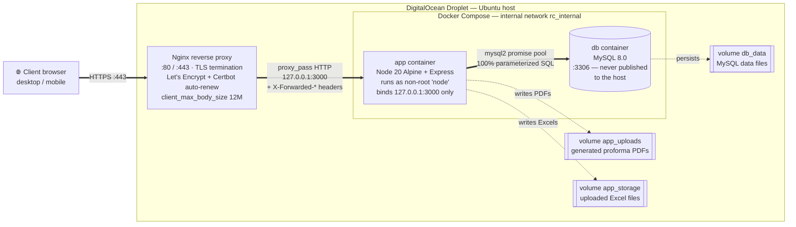
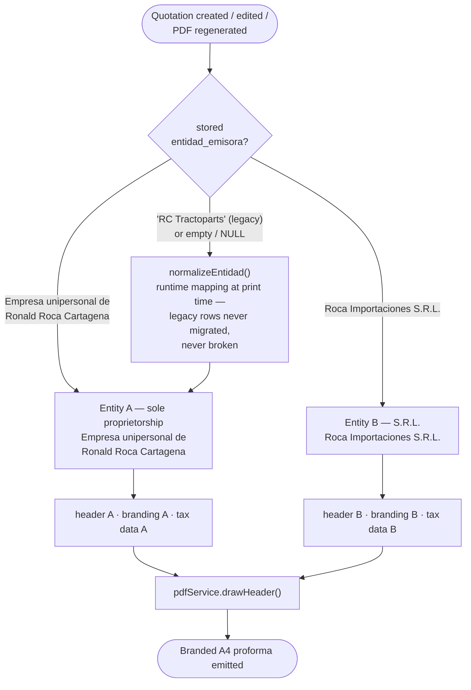
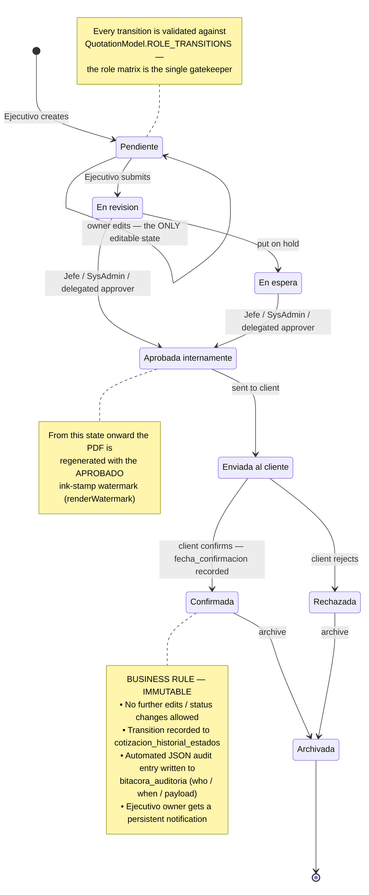
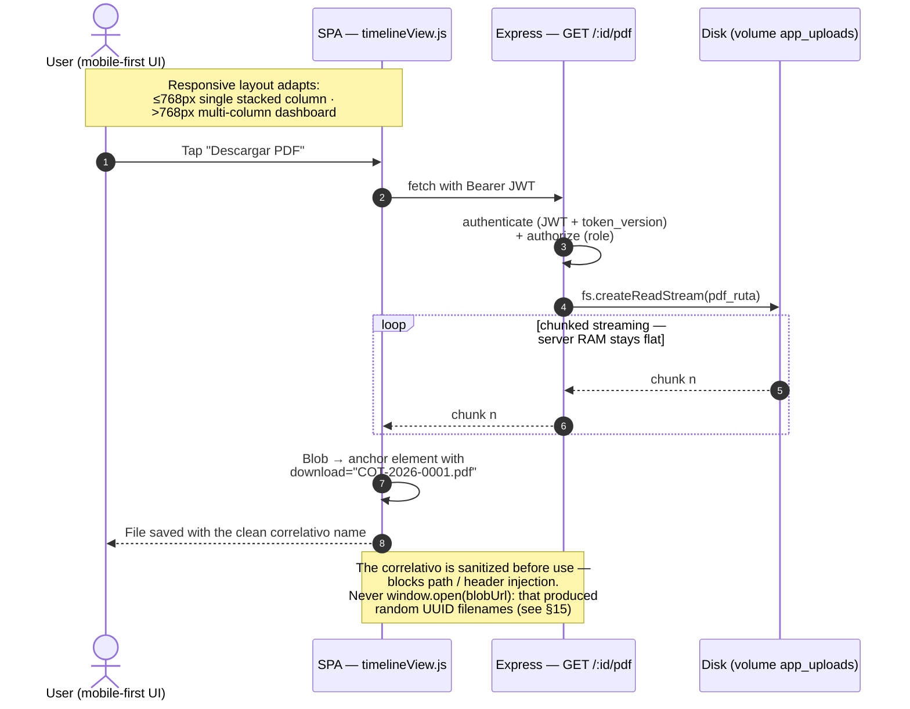
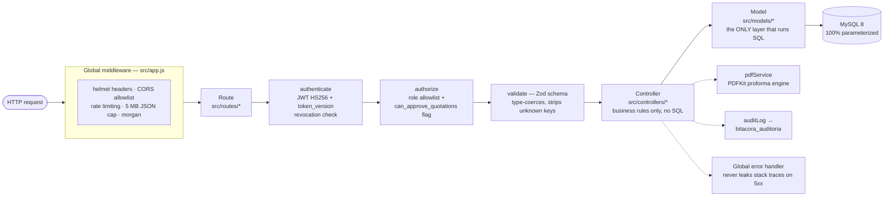
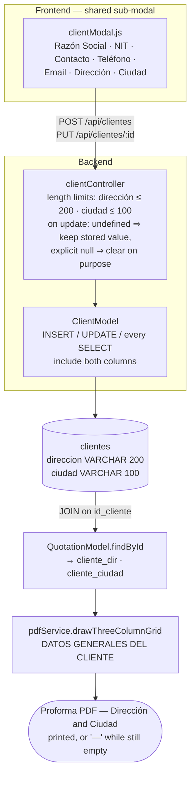
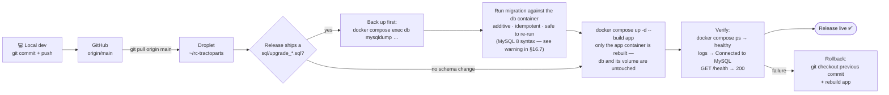

# RC Tractoparts — Quotation Management System

> 🇪🇸 ¿Prefieres leer esto en español? → [README en Español](README.es.md)


REST API and lightweight web client for managing **quotations (proformas)** for **Empresa unipersonal de Ronald Roca Cartagena** (formerly branded "RC Tractoparts") and **Roca Importaciones S.R.L.**, a heavy-machinery spare-parts importer in Santa Cruz, Bolivia. The system covers the full quotation lifecycle: client/brand catalogs, atomic correlativo generation, a role-based approval state machine, multi-company corporate-branded PDF generation, file uploads (PDF + Excel), in-app notifications, auditing, and business-intelligence reports.

The backend is a Node.js + Express REST API backed by MySQL. The frontend is a vanilla-JavaScript (ES Modules) single-page application (SPA) served as static files by the same Express process — no build step required. The whole stack is containerized with Docker and orchestrated with Docker Compose.

---

## Table of Contents

1. [Project Overview](#1-project-overview)
2. [System Architecture & Tech Stack](#2-system-architecture--tech-stack)
3. [Architecture & Workflow Diagrams](#3-architecture--workflow-diagrams)
4. [Project Directory Tree](#4-project-directory-tree)
5. [Prerequisites](#5-prerequisites)
6. [Local Installation via Docker](#6-local-installation-via-docker)
7. [Manual (Non-Docker) Installation](#7-manual-non-docker-installation)
8. [Local Execution](#8-local-execution)
9. [Environment Variables](#9-environment-variables)
10. [Functional Overview](#10-functional-overview)
11. [Frontend Architecture](#11-frontend-architecture)
12. [Security Model](#12-security-model)
13. [Tests](#13-tests)
14. [Business Entity & Legal Naming](#14-business-entity--legal-naming)
15. [PDF & Download Handler Refactors](#15-pdf--download-handler-refactors)
16. [Production Deployment (Nginx + DigitalOcean)](#16-production-deployment-nginx--digitalocean)
17. [License](#license)

---

## 1. Project Overview

- **Purpose:** Replace manual proforma spreadsheets with a controlled, audited workflow — executives build quotations, managers approve them, and the system emits a consistent branded PDF for the client.
- **Company:** The primary issuing legal entity is **Empresa unipersonal de Ronald Roca Cartagena** (formerly branded "RC Tractoparts"), with **Roca Importaciones S.R.L.** remaining active as the second issuing entity. An importer of heavy-machinery spare parts (Volvo, Komatsu, John Deere, JCB, CAT, CASE) based in Santa Cruz, Bolivia. See [§14 Business Entity & Legal Naming](#14-business-entity--legal-naming) for the full rename refactor and legacy-tolerance details.
- **Users / roles:** `Ejecutivo`, `Administracion`, `Jefe`, `SysAdmin`, plus a per-user `can_approve_quotations` delegation flag (Delegación de Funciones).
- **Key invariants:** every state change is role-validated and audited; each quotation owns exactly **one** physical PDF (regenerated on every meaningful change); all SQL is parameterized; the correlativo serial is generated atomically under a row lock.

---

## 2. System Architecture & Tech Stack

**Architecture:** Single Node.js process. `src/server.js` validates the DB connection then starts Express; `src/app.js` builds the middleware/route graph and is exported separately so tests can import it without binding a port. Layering is strict: **routes → controllers → models → MySQL**. Only models execute SQL.

| Concern | Technology (exact) |
|---|---|
| Runtime | Node.js `>= 18` (Docker image: Node 20 LTS Alpine) |
| Web framework | Express `^4.19.2` |
| Database | MySQL 8 via `mysql2 ^3.9.7` (promise pool) |
| Authentication | `jsonwebtoken ^9.0.2` (HS256) + `bcryptjs ^2.4.3` |
| Input validation | `zod ^4.4.3` |
| PDF generation | `pdfkit ^0.18.0` |
| File uploads | `multer ^1.4.5-lts.1` |
| Security headers / CORS / rate-limit | `helmet ^7.1.0`, `cors ^2.8.5`, `express-rate-limit ^8.5.2` |
| HTTP logging | `morgan ^1.10.0` |
| API documentation | `swagger-jsdoc ^6.3.0` + `swagger-ui-express ^5.0.1` |
| Config | `dotenv ^16.4.5` |
| Tests | `jest ^29.7.0` + `supertest ^7.0.0` |
| Linting | `eslint ^10.5.0` (flat config) |
| Dev reload | `nodemon ^3.1.0` |
| Frontend | Vanilla JS (ES Modules), no build step |
| Containerization | Docker (multi-stage) + Docker Compose |

**Database tables** (`sql/init.sql`): `roles`, `usuarios`, `marcas`, `clientes`, `productos`, `cotizaciones_correlativo`, `cotizaciones`, `cotizacion_detalles`, `auditoria`, `bitacora_auditoria`, `cotizacion_historial_estados`, `notificaciones`.

The `cotizaciones.entidad_emisora` column (the issuing business name printed on each PDF header) is stored as **`VARCHAR(150)`**, providing ample headroom for the 44-character legal name `Empresa unipersonal de Ronald Roca Cartagena`.

**Quotation state machine** (enforced per role in `QuotationModel.ROLE_TRANSITIONS`):
`Pendiente → En revision → En espera → Aprobada internamente → Enviada al cliente → Confirmada / Rechazada → Archivada`.

> **Historical note:** the confirmed-quotation status was renamed from `Aceptada` to `Confirmada`. A migration in `sql/init.sql` rewrites legacy `Aceptada` rows (and their history entries) to `Confirmada`, and the value is retained in tolerant allow-lists so pre-rename data never breaks validation.

---

## 3. Architecture & Workflow Diagrams

### 3.1 Deployment & Infrastructure Architecture

Request flow from the client, over HTTPS, through the host's Nginx reverse proxy (Let's Encrypt SSL termination), into the isolated Docker containers. Neither container is ever reachable from the internet: the app binds to loopback only, and MySQL is not published at all.



### 3.2 Multi-Company Dynamic Logic

How the system resolves separate headers, branding, and tax information from the `entidad_emisora` stored on each quotation — including the graceful runtime mapping that lets pre-rename rows (`'RC Tractoparts'`) print correctly **without any data migration**.



### 3.3 Document Lifecycle State Machine

Comprehensive quotation workflow, emphasizing the business rules of the **`Confirmada`** state — its absolute immutability and the automated audit-logging trigger.



### 3.4 System Performance & UI Flow

Mobile-first responsive layout transitions and the memory-efficient asynchronous PDF streaming download (chunked stream responses that avoid RAM saturation).



### 3.5 Request Pipeline & Strict Layering

Every API request crosses the same gauntlet before any business logic runs. Layering is strict — **only models execute SQL** — so security concerns live in exactly one place each.



### 3.6 Client Data Slice — Dirección / Ciudad End-to-End

The full vertical path a client's address travels, from the shared client modal to the printed proforma. This is the slice completed in §15 — before that fix the write side (modal → controller → model) simply didn't exist, so the PDF always printed `—`.



### 3.7 Release & Schema-Migration Flow

How a change reaches production. The key rule: **additive schema migrations run against the live DB *before* the new app code that depends on them is built** — never the other way around, and never via `db:init` (which is destructive).



---

## 4. Project Directory Tree

```
rc-tractoparts/
├── Dockerfile                     # Multi-stage build (deps → runner, non-root)
├── docker-compose.yml             # app + MySQL + volumes + internal network
├── .dockerignore                  # Keeps secrets/tests/artifacts out of the image
├── src/
│   ├── server.js                  # Entry point: DB check + HTTP listen + graceful shutdown
│   ├── app.js                     # Express app: middleware, Swagger, routes, error handler
│   ├── config/
│   │   └── db.js                  # MySQL connection pool (singleton) + startup ping
│   ├── routes/                    # /api/auth, /api/cotizaciones, /api/usuarios, …
│   ├── controllers/               # Request handlers (incl. quotation/ subfolder)
│   ├── models/                    # ONLY layer that runs SQL (all parameterized)
│   ├── middlewares/               # authMiddleware, roleMiddleware, auditMiddleware
│   ├── validators/                # Zod schemas + validate() factory
│   ├── services/
│   │   └── pdfService.js          # PDFKit proforma layout engine
│   ├── realtime/
│   │   └── socketServer.js        # Realtime socket layer (quotation locks / live events)
│   ├── utils/
│   │   └── auditLog.js
│   └── assets/images/             # rc_logo.png + brands/*.png (used by the PDF engine)
├── public/                        # Static frontend (served by Express)
│   ├── index.html                 # Login
│   ├── dashboard.html
│   ├── css/styles.css
│   └── js/{services,views}/        # apiClient, authSession, dashboard views
├── sql/
│   ├── init.sql                   # Single source of truth: full schema + seed data (DESTRUCTIVE)
│   ├── init.js                    # Runs init.sql (admin connection, multipleStatements)
│   └── upgrade_*.sql              # One-time ADDITIVE migrations for live DBs (see §16.7)
├── scripts/
│   └── seed-users.js              # Generates bcrypt hashes; seeds dev/test users
├── tests/
│   ├── unit/                      # No DB required
│   └── integration/               # Requires the test database
├── uploads/                       # Generated/uploaded PDFs (gitignored, runtime volume)
├── storage/excels/                # Uploaded Excel spreadsheets (gitignored, runtime volume)
├── .env.example                   # Environment variable reference
├── eslint.config.js
└── package.json
```

---

## 5. Prerequisites

**For the Docker workflow (recommended):**

- **Docker Engine 24+** and the **Docker Compose v2** plugin.
- No local Node.js or MySQL installation required — both run inside containers.

**For the manual workflow:**

- **Node.js `>= 18`** and npm (the lockfile is npm-based).
- **MySQL Server 8.x** running and reachable, with an account that can create databases (for `npm run db:init`).

---

## 6. Local Installation via Docker

The repository ships with a production-oriented multi-stage `Dockerfile` and a `docker-compose.yml` that orchestrates the application and a persistent MySQL database on an isolated internal network.

```bash
# 1. Clone and enter the project
git clone <repo-url> rc-tractoparts && cd rc-tractoparts

# 2. Create your environment file from the template and fill in real secrets
cp .env.example .env          # Windows PowerShell: Copy-Item .env.example .env

# 3. Build the images and start the stack (detached)
docker compose up -d --build

# 4. Follow the application logs
docker compose logs -f app
```

**What happens on first `up`:**

- The `db` service initializes MySQL and **auto-runs `sql/init.sql`** (mounted into `/docker-entrypoint-initdb.d/`), which drops/recreates the schema and seeds roles, brands, sample clients, the year counter, and the initial privileged accounts.
- The `app` service waits until the database reports **healthy** (`depends_on: condition: service_healthy`), then starts Express.
- Generated PDFs and uploaded Excel files persist in the named volumes `app_uploads` and `app_storage`; database data persists in `db_data`.

**Endpoints (published to the host on `127.0.0.1` only):**

- Frontend / login: `http://localhost:3000/`
- Health check: `http://localhost:3000/health`
- Swagger UI: `http://localhost:3000/api-docs`

**Common commands:**

```bash
docker compose ps                 # Container status
docker compose logs -f app        # Tail app logs
docker compose exec app sh        # Shell into the app container
docker compose exec db mysql -u root -p   # MySQL client inside the db container
docker compose down               # Stop and remove containers (volumes are kept)
docker compose down -v            # Stop and ALSO remove volumes (destroys data)
```

> ⚠️ `sql/init.sql` is **destructive** — on first initialization it drops any existing `rc_tractoparts` database. It only auto-runs when the `db_data` volume is empty (first boot).

**Initial accounts seeded by `init.sql`** (rotate these in production):

| Username | Role | Raw password |
|---|---|---|
| `SysAdmin` | SysAdmin (4) | `Admin#RC2026` |
| `ronald` | Jefe (3) | `Ronald#RC2026` |
| `angelica` | Administracion (2) | `Angelica#RC2026` |

`Ejecutivo` accounts are **not** seeded; they are created from inside the platform via `POST /api/usuarios`.

---

## 7. Manual (Non-Docker) Installation

```bash
# 1. Install dependencies
npm install

# 2. Create your environment file from the template
cp .env.example .env          # Windows PowerShell: Copy-Item .env.example .env

# 3. Edit .env with your real values (keep DB_HOST=localhost for a local MySQL)

# 4. Initialize the database (destructive — drops rc_tractoparts first)
npm run db:init

# 5. (Optional) Seed development/test users with fresh bcrypt hashes
npm run seed            # PREVIEW only — prints SQL, writes nothing
npm run seed:execute    # Connects and upserts the dev users into the DB
```

> `db:init` opens a one-shot admin connection (no pre-selected DB, `multipleStatements` enabled) and runs the whole `sql/init.sql` script.

---

## 8. Local Execution

```bash
# Development (auto-reload via nodemon)
npm run dev

# Production-style start
npm start
```

On a successful start the server validates the DB connection, then listens on `PORT` (default **3000**). If MySQL is unreachable, startup aborts with a non-zero exit code.

**Quality / tests:**

```bash
npm run lint              # ESLint over src/
npm run test:unit         # Unit tests — NO database required
npm run test:integration  # Integration tests — REQUIRES rc_tractoparts_test DB
npm test                  # Full Jest run (integration parts need the test DB)
```

---

## 9. Environment Variables

All secrets and configuration are externalized to `.env` (never committed). Reference (`.env.example`):

| Variable | Group | Description |
|---|---|---|
| `NODE_ENV` | App | `development` \| `production` \| `test` |
| `PORT` | App | HTTP port Express listens on (default `3000`) |
| `APP_NAME` | App | Display name used in logs / Swagger |
| `DB_HOST` | Database | MySQL host. In Docker Compose it is overridden to the `db` service name |
| `DB_PORT` | Database | MySQL port (default `3306`) |
| `DB_USER` | Database | Application DB user |
| `DB_PASSWORD` | Database | Application DB user password (**secret**) |
| `DB_NAME` | Database | Primary database name (`rc_tractoparts`) |
| `DB_NAME_TEST` | Database | Database used only when `NODE_ENV=test` |
| `DB_ROOT_PASSWORD` | Database | MySQL **root** password for the Compose `db` service (**secret**) |
| `DB_CONNECTION_LIMIT` | Database | Max simultaneous pool connections |
| `DB_QUEUE_LIMIT` | Database | Queue cap; `0` = unlimited |
| `JWT_SECRET` | Auth | HS256 signing secret, ≥ 64 random chars (**secret**) |
| `JWT_EXPIRES_IN` | Auth | Token lifetime (e.g. `8h`) |
| `BCRYPT_ROUNDS` | Auth | bcrypt cost factor |
| `MAX_LOGIN_ATTEMPTS` | Security | Failures before account lock |
| `LOCK_DURATION_MINUTES` | Security | Account-lock duration |
| `UPLOAD_DIR` | Uploads | PDF upload directory (default `uploads/cotizaciones`) |
| `MAX_PDF_SIZE_MB` | Uploads | Maximum PDF size in MB |
| `CORS_ORIGIN` | CORS | Comma-separated allowed origins (your public HTTPS domain in production) |

> **Secret generation:** create a strong JWT secret with `openssl rand -hex 64`. Never hardcode secrets in source, the Dockerfile, or `docker-compose.yml` — Compose reads them from `.env` at runtime.

---

## 10. Functional Overview

### Web client (served from `public/`)

- **Login** (`index.html`) — username/password, JWT stored client-side via `authSession`.
- **Dashboard** (`dashboard.html`) — role-aware views: quotation list/filters, quotation form, approval queue, notifications, timeline/history, and BI reports.

### REST API surface

| Area | Endpoints | Access |
|---|---|---|
| **Auth** | `POST /api/auth/login`, `POST /api/auth/logout` | Public / authenticated |
| **Quotations** | `GET /` (paginated+filtered), `POST /`, `GET /:id`, `PUT /:id` (owner, Pendiente only), `GET /resumen`, `GET /pendientes-aprobacion`, `GET /:id/historial` | All authenticated roles (writes role-scoped) |
| **Quotation state** | `PUT /:id/estado` (role state machine), `POST /:id/aprobar` (Jefe/SysAdmin), `PATCH /:id/comentario-admin` (Administracion) | Role-restricted |
| **Quotation files** | `POST /:id/pdf`, `POST /:id/upload` (PDF+Excel), `GET /:id/pdf`, `GET /:id/excel` | Ejecutivo upload / all download |
| **Notifications** | `GET /api/cotizaciones/notificaciones`, `POST /…/notificaciones/leer` | Ejecutivo |
| **Users** | `GET /`, `POST /`, `GET /:id`, `PUT /:id` (Jefe/Administracion/SysAdmin), `DELETE /:id` soft-delete (Jefe/SysAdmin) | Management roles |
| **Clients** | `GET /` (autocomplete, 20 active), `GET /all` (paginated, incl. inactive), `GET /:id`, `POST /`, `PUT /:id` (also reactivates via `activo`), `DELETE /:id` soft-delete | All roles |
| **Brands** | `GET /api/marcas`, `POST /api/marcas` | Quote-creating roles |
| **Reports** | `GET /api/reportes/progreso` (Jefe/SysAdmin), `GET /api/reportes/advanced` (row-level security for Ejecutivo) | Restricted |
| **System** | `GET /health` | Public |
| **API Docs** | `GET /api-docs` | Public (Swagger UI) |

### Cross-cutting behavior

- **Security:** Helmet headers, configurable CORS allowlist, global rate limiting (with stricter limits on login and uploads), 5 MB JSON body cap, and a hardened global error handler that never leaks stack traces or internals on 5xx.
- **Auth & sessions:** JWT (HS256, 8 h default) carrying the role name and a `token_version`; logout bumps the persistent counter so revocation survives restarts. Brute-force lockout after repeated failures.
- **Validation:** Zod schemas sanitize and type-coerce every write at the boundary; unknown keys are stripped.
- **Auditing:** significant actions are written to `bitacora_auditoria` / `auditoria`; per-quotation state transitions are recorded in `cotizacion_historial_estados`.
- **PDF engine:** generates an A4 corporate proforma (logo, partner-brand strip, client/requester/equipment grid, line-item table with es-BO number formatting, amount-in-words, bank data, and an `APROBADO` stamp on approved quotations). Uploaded files are validated by magic number, not just declared MIME type.
- **Notifications:** Ejecutivo users receive persistent in-app notifications on quotation state changes; unread items remain visible until explicitly acknowledged via `POST /…/notificaciones/leer`.

---

## 11. Frontend Architecture

The frontend is a vanilla JavaScript SPA using ES Modules — no transpiler or bundler required. Design patterns applied:

**Strategy Pattern** — role-based rendering is delegated to concrete strategy objects chosen at login time:
- `ExecutiveStrategy` — Ejecutivo / Administracion: summary stats, own quotation table, "Nueva Cotización" action.
- `ManagerStrategy` — Jefe: global overview, pending-approval queue, User CRUD panel, Audit Logs workspace.

**Command Pattern** — critical mutations are encapsulated as Command objects with a single `execute()` method:
- `ApproveQuotationCommand` — `POST /:id/aprobar`
- `ChangeStatusCommand` — `PUT /:id/estado`
- `DeactivateUserCommand` — `DELETE /api/usuarios/:id`
- `CreateUserCommand` — `POST /api/usuarios`

**Module breakdown:**

| Module | Responsibility |
|---|---|
| `apiClient.js` | Axios-style fetch wrapper, automatic JWT injection, toast feedback |
| `authSession.js` | JWT storage and role-decoding utilities |
| `socketClient.js` | Realtime socket connection (see `src/realtime/socketServer.js`) |
| `authView.js` | Login screen controller |
| `dashboardView.js` | Main controller, strategy selection, Command invoker |
| `quotationForm.js` | Multi-step quotation creation / editing form |
| `dashboard/helpers.js` | Shared formatters, badge builders, escape utils |
| `dashboard/modules/timelineView.js` | State history timeline, PDF/Excel download buttons |
| `dashboard/modules/reportesView.js` | BI charts and leaderboard tables |
| `dashboard/modules/notificationsView.js` | Notification badge polling and read marking |
| `dashboard/modules/auditView.js` | Audit-log workspace (Jefe / SysAdmin) |
| `dashboard/modules/clientsView.js` | "Gestión de Clientes" tab: list, edit, deactivate, reactivate |
| `dashboard/modules/clientModal.js` | Shared create/edit client sub-modal — the single place the client fields, validation, and duplicate-NIT handling live |

The UI is **mobile-first responsive**: at narrow widths the dashboard collapses into a single stacked column, expanding into a multi-column layout on larger screens (see [§3.4](#34-system-performance--ui-flow)).

---

## 12. Security Model

| Layer | Mechanism |
|---|---|
| Transport | HTTPS terminated at the Nginx reverse proxy (Let's Encrypt) |
| Headers | `helmet` — CSP, X-Frame-Options, HSTS, etc. |
| CORS | Allowlist-based; origins configured via `CORS_ORIGIN` env var |
| Rate limiting | Global + stricter on `/api/auth/login` and file uploads |
| Authentication | HS256 JWT, 8h expiry, `token_version` revocation |
| Authorization | Role-based (`ROLE_TRANSITIONS` matrix) + per-user delegation flag |
| Input validation | Zod schemas at every write boundary; unknown keys stripped |
| SQL injection | 100% parameterized queries via `mysql2` promise pool |
| File uploads | Magic-number validation (not MIME type); size-capped by multer |
| Brute force | Lockout after `MAX_LOGIN_ATTEMPTS` failures for `LOCK_DURATION_MINUTES` |
| Error handling | Global handler; stack traces / internals never exposed on 5xx |
| Auditing | All significant actions logged to `bitacora_auditoria` |
| Secrets | Externalized to `.env`; never hardcoded in source or images |
| Container | Runs as non-root `node` user; MySQL never exposed to the public network |

---

## 13. Tests

```bash
npm run test:unit         # Unit tests — NO database required
npm run test:integration  # Integration tests — REQUIRES rc_tractoparts_test DB
npm test                  # Full Jest run (integration parts need the test DB)
```

**Test suites:**

| File | Type | What it covers |
|---|---|---|
| `tests/unit/calcularTotales.test.js` | Unit | Line-item total and grand-total calculation logic |
| `tests/unit/validationEdgeCases.test.js` | Unit | Zod schema edge cases and boundary validation |
| `tests/integration/correlativo.concurrencia.test.js` | Integration | Atomic correlativo generation under concurrent requests |
| `tests/integration/newFeatures.test.js` | Integration | Admin notes visibility (NF-03) + persistent notifications (NF-04) |

> Integration tests connect to the database named by `DB_NAME_TEST` when `NODE_ENV=test`. Create and initialize that database before running them.

---

## 14. Business Entity & Legal Naming

The primary business entity name was officially changed from **"RC Tractoparts"** to **"Empresa unipersonal de Ronald Roca Cartagena"**. This refactor was applied consistently across **all layers** of the stack:

| Layer | Where | Change |
|---|---|---|
| Database | `sql/init.sql` | `cotizaciones.entidad_emisora` default is `'Empresa unipersonal de Ronald Roca Cartagena'`, stored as `VARCHAR(150)` |
| Backend validation | `src/validators/quotationValidator.js` | `VALID_ENTITIES` allow-list uses the new legal name as the primary value |
| Frontend selector | `public/js/views/quotationForm.js` | Issuing-entity dropdown/hydration defaults to the new legal name |
| PDF / Excel headers | `src/services/pdfService.js` | PDF proforma header text renders the new legal name |

- **Second entity unchanged:** `Roca Importaciones S.R.L.` remains active and is unchanged as the second selectable issuing entity.
- **Graceful legacy mapping:** the system implements a runtime mapping pattern so that legacy records still containing the `'RC Tractoparts'` string are tolerated without breaking validation or UI hydration:
  - `quotationValidator.js` keeps `'RC Tractoparts'` in the `VALID_ENTITIES` allow-list, so pre-rename rows still validate on edit/re-save.
  - `pdfService.js` exposes `normalizeEntidad()`, which maps any stored `'RC Tractoparts'` value (or blank) to `Empresa unipersonal de Ronald Roca Cartagena` at print time — old quotations render the correct header **without any data migration**.

> This mirrors the same legacy-tolerance approach used for the `Aceptada` → `Confirmada` state rename (see [§2](#2-system-architecture--tech-stack)). The dynamic per-entity header/branding/tax resolution is illustrated in [§3.2](#32-multi-company-dynamic-logic).

---

## 15. PDF & Download Handler Refactors

### Items-table header color (`src/services/pdfService.js`)

The `DETALLE DE ÍTEMS COTIZADOS` table header was originally a pastel pink (`#FADADD` background with `#4A1622` maroon text) and its rows alternated with a pink-tinted `#FFF8F8`. The pink read as decorative rather than corporate on a document sent to clients, so the header now reuses the palette's existing primary **navy** with white text:

| Palette key | Before | After | Used for |
|---|---|---|---|
| `TABLE_HEADER` (was `PINK_HEADER`) | `#FADADD` | `#1B2B4B` | Items table header background |
| `TABLE_HEADER_TEXT` (was `PINK_TEXT`) | `#4A1622` | `#FFFFFF` | Items table header text |
| `ALT_ROW` | `#FFF8F8` | `#F7F8FA` | Alternating row tint |

This reuses `NAVY` (already the color of the document header and totals box) instead of introducing a fourth hue, keeps the header legible when the proforma is printed in black and white, and drops the last pink tint from the line-item rows.

> The `APROBADO` watermark keeps its magenta ink (`STAMP_COLOR = '#C71585'`, `drawApprovedStamp`) **by design** — it replicates the company's physical rubber stamp and is not part of the table styling.

### Client Dirección / Ciudad — completing the vertical slice

The `DATOS GENERALES DEL CLIENTE` grid on the PDF always rendered **Dirección** and **Ciudad** as `—`. The cause was a half-wired vertical slice, not a PDF bug:

- `clientes.direccion` / `clientes.ciudad` **existed** in `sql/init.sql`.
- `QuotationModel.findById` **already** selected them as `cliente_dir` / `cliente_ciudad`, and `pdfService.drawThreeColumnGrid` **already** printed them.
- But nothing in between ever **wrote** them: the client modal had no inputs, `clientController` never read them off the request body, and `ClientModel`'s `INSERT`/`UPDATE`/`SELECT` statements omitted the columns entirely. The columns were therefore always `NULL`.

The fix wires the missing middle (see the end-to-end path in [§3.6](#36-client-data-slice--dirección--ciudad-end-to-end)):

| Layer | File | Change |
|---|---|---|
| Frontend | `public/js/views/dashboard/modules/clientModal.js` | Added the Dirección / Ciudad inputs and included them in the create/update payload |
| Controller | `src/controllers/clientController.js` | Reads both off the body, enforces the 200 / 100-char limits, and resolves them on update |
| Model | `src/models/ClientModel.js` | Added both columns to every `SELECT`, plus the `INSERT` and `UPDATE` |
| API docs | `src/routes/clientRoutes.js` | Documented both fields on `POST /` and `PUT /:id` |
| Seed | `sql/init.sql` | Sample clients now ship with a real address and city |
| Migration | `sql/upgrade_2026_cliente_direccion_ciudad.sql` | Idempotent `ALTER` for databases initialised before the columns entered `init.sql` — a no-op where they already exist (see [§16.7](#167-schema-migrations-sqlupgrade_sql)) |

> ⚠️ **Data-preservation rule.** `ClientModel.update` writes *every* column on each call, so any caller that omits a field would blank it. Two callers post a fixed field list that does not include Dirección/Ciudad — the "Activar" (reactivate) button in `clientsView.js` and `ClientController.deactivate`. To stop either from silently wiping a saved address, `update` resolves both fields the same way it already resolves `activo`: **`undefined` means "not sent — keep the stored value"**, while an explicit `null` still clears the field on purpose. Any new caller of `ClientModel.update` must respect this.

### Logo alignment fix (`src/services/pdfService.js`)

The primary brand logo alignment in `drawHeader()` was changed from `align: 'center'` to `align: 'left'`. The logo is a wide landscape image that, when fitted by height into its box, is narrower than the box width; with `align: 'center'` PDFKit padded the extra horizontal space on both sides, pushing the visible logo **~12 pt to the right**. Switching to `align: 'left'` pins the logo's left edge exactly at `x = MARGIN = 36`, aligning it cleanly with the address and contact-details text block rendered directly below it.

### Clean-filename download handler refactor (`public/js/views/dashboard/modules/timelineView.js`)

The legacy download approach used `window.open(blobUrl)` on a raw `blob:` URL, which caused browsers to save PDFs with an unreadable random UUID filename (e.g. `32cb1a0d-…`), breaking the executives' "download & send to client via WhatsApp" workflow.

This was completely replaced by a **dynamic anchor-tag injection** technique (`document.createElement('a')` with the `download` attribute set). Now both **PDFs and Excel files** download while enforcing the real, clean quotation alphanumeric identifier as the filename (e.g. `COT-2026-0001.pdf`). The correlativo is sanitized before use to block any path/header-injection characters. The download itself is served via **chunked streaming** to keep server memory flat (see [§3.4](#34-system-performance--ui-flow)).

---

## 16. Production Deployment (Nginx + DigitalOcean)

The recommended production topology runs the Docker Compose stack on a **DigitalOcean Droplet**, with **Nginx on the host** acting as a TLS-terminating reverse proxy in front of the containerized app. See the diagram in [§3.1](#31-deployment--infrastructure-architecture).

### 16.1 Provision the Droplet

1. Create an Ubuntu 22.04 LTS Droplet and point your domain's `A` record at its public IP.
2. Harden SSH, create a non-root sudo user, and enable the firewall:
   ```bash
   sudo ufw allow OpenSSH
   sudo ufw allow 'Nginx Full'   # opens 80 and 443
   sudo ufw enable
   ```
3. Install Docker Engine + Compose plugin and Nginx + Certbot:
   ```bash
   curl -fsSL https://get.docker.com | sh
   sudo apt-get install -y nginx certbot python3-certbot-nginx
   ```

### 16.2 Deploy the application stack

```bash
git clone <repo-url> /opt/rc-tractoparts && cd /opt/rc-tractoparts
cp .env.example .env          # fill in production secrets (strong passwords + JWT)
# Set CORS_ORIGIN=https://cotizaciones.tudominio.com in .env
docker compose up -d --build
```

The `app` container binds to **`127.0.0.1:3000`** only — it is never publicly exposed. Only Nginx faces the internet.

### 16.3 Configure Nginx as a reverse proxy

Create `/etc/nginx/sites-available/rc-tractoparts`:

```nginx
server {
    listen 80;
    server_name cotizaciones.tudominio.com;

    # Allow large PDF/Excel uploads (matches MAX_PDF_SIZE_MB)
    client_max_body_size 12M;

    location / {
        proxy_pass http://127.0.0.1:3000;
        proxy_http_version 1.1;
        proxy_set_header Host              $host;
        proxy_set_header X-Real-IP         $remote_addr;
        proxy_set_header X-Forwarded-For   $proxy_add_x_forwarded_for;
        proxy_set_header X-Forwarded-Proto $scheme;
    }
}
```

Enable it and reload:

```bash
sudo ln -s /etc/nginx/sites-available/rc-tractoparts /etc/nginx/sites-enabled/
sudo nginx -t && sudo systemctl reload nginx
```

> The app already calls `app.set('trust proxy', 1)`, so `X-Forwarded-*` headers are honored for correct client IPs and rate limiting.

### 16.4 Enable HTTPS with Let's Encrypt

```bash
sudo certbot --nginx -d cotizaciones.tudominio.com
```

Certbot obtains the certificate, rewrites the Nginx config to listen on `:443` with TLS, and installs an automatic renewal timer. All client traffic is now HTTPS; TLS is terminated at Nginx and forwarded as plain HTTP to the container on the loopback interface.

### 16.5 Persistence & storage warning

Generated PDFs (`uploads/cotizaciones/`) and uploaded Excel files (`storage/excels/`) are written to disk and persisted via the Docker named volumes `app_uploads` and `app_storage`; the database persists via `db_data`.

> ⚠️ On **ephemeral/serverless** platforms (e.g. Render, Heroku) local files are wiped on every restart/redeploy. A persistent-disk Droplet with named volumes (as above) avoids this. For horizontal scaling, migrate file storage to **object storage** (DigitalOcean Spaces / S3) or stream generated documents in-memory instead of writing to local disk.

### 16.6 Operations

```bash
docker compose pull && docker compose up -d --build   # deploy an update
docker compose logs -f app                            # tail logs
docker compose exec db mysqldump -u root -p rc_tractoparts > backup.sql   # DB backup
```

### 16.7 Schema migrations (`sql/upgrade_*.sql`)

`sql/init.sql` only auto-runs on the **first** boot (empty `db_data` volume) and is **destructive** — it must never be run against a live database. Schema changes for an already-running production DB ship instead as standalone, **additive** scripts in `sql/upgrade_*.sql`:

| Script | Adds |
|---|---|
| `upgrade_2026_correlativo_692.sql` | Seeds the 2026 correlativo counter at 691 |
| `upgrade_2026_fecha_confirmacion.sql` | `cotizaciones.fecha_confirmacion` + historical backfill |
| `upgrade_2026_delegacion_ampliada.sql` | Delegation support (`can_approve_quotations`) |
| `upgrade_2026_cliente_direccion_ciudad.sql` | `clientes.direccion` / `clientes.ciudad` (no-op on DBs whose schema already has them) |
| `upgrade_2026_origenes_cliente.sql` | `origenes_cliente` catalog + `clientes.id_origen_cliente` (idempotent) |

**Procedure** (order matters — migrate *before* rebuilding the app, so the new code never queries columns that don't exist yet; see the flow in [§3.7](#37-release--schema-migration-flow)):

```bash
cd ~/rc-tractoparts
docker compose exec db mysqldump -u root -p rc_tractoparts > backup-$(date +%F).sql  # 1. backup
git pull origin main                                                                  # 2. code
docker compose exec -T db mysql -u root -p rc_tractoparts < sql/upgrade_XXXX.sql      # 3. migrate
docker compose up -d --build app                                                      # 4. rebuild app only
docker compose ps && docker compose logs --tail=40 app                                # 5. verify healthy
```

> ⚠️ **MySQL syntax warning.** `ALTER TABLE … ADD COLUMN IF NOT EXISTS` is a **MariaDB extension** — on the real MySQL 8 this stack runs (`image: mysql:8.0`) it is a syntax error (`ER_PARSE_ERROR` 1064). Idempotent migrations here must use the portable pattern instead: probe `information_schema.COLUMNS`, then conditionally `PREPARE`/`EXECUTE` the `ALTER` — see `upgrade_2026_cliente_direccion_ciudad.sql` for the reference implementation. Some earlier upgrade scripts still carry the MariaDB form; verify their effect with a `SHOW COLUMNS` check rather than assuming they applied.

---

## License

UNLICENSED — © Empresa unipersonal de Ronald Roca Cartagena (formerly RC Tractoparts), Departamento de Sistemas.
