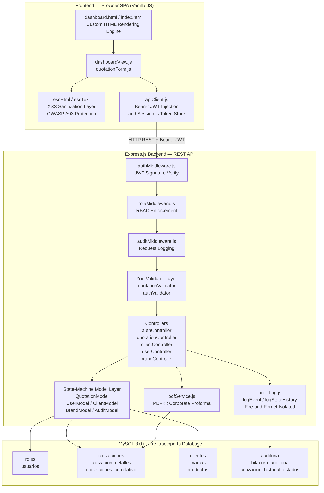
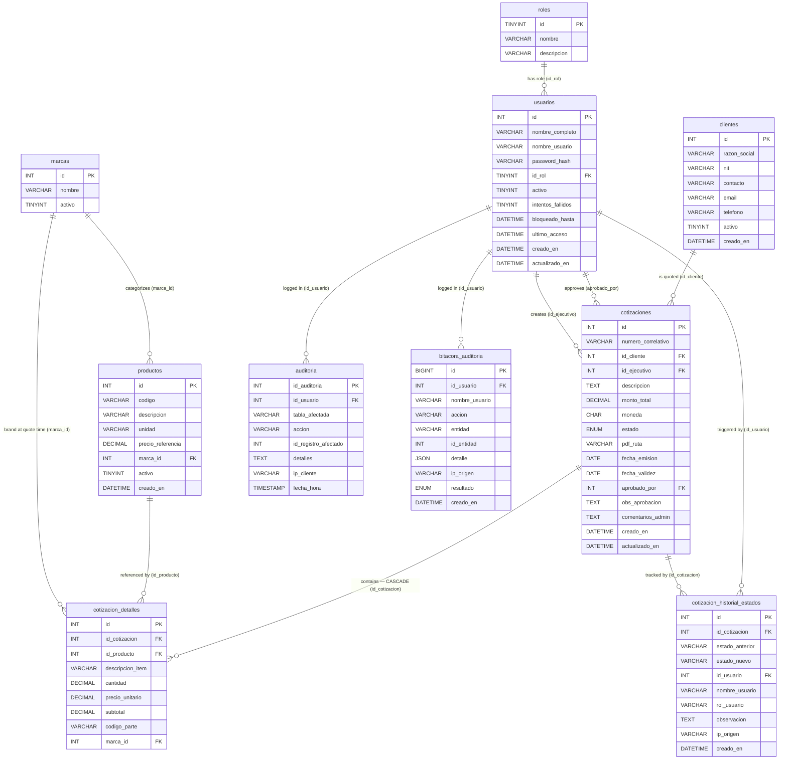
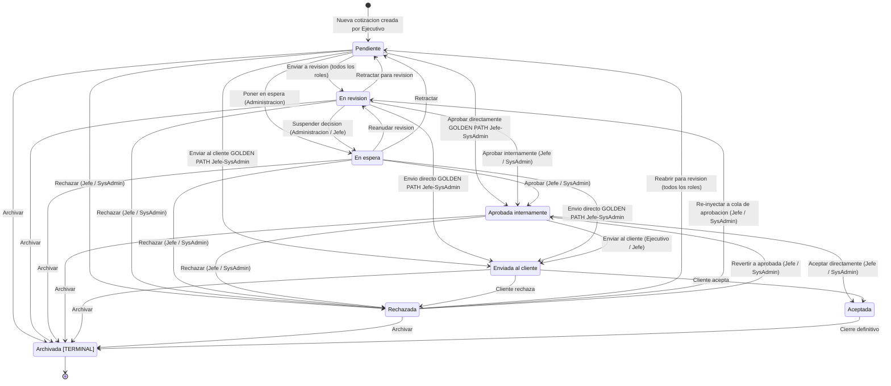

<div align="center">

# 🚜 RC Tractoparts — Quotation Management System

**Production-Grade Full-Stack Quotation & Proforma Platform**

*Universidad Tecnológica Privada de Santa Cruz (UTEPSA) · Carrera de Ingeniería de Sistemas*

---


</div>

---

## Table of Contents

1. [Project Overview & Context](#1-project-overview--context)
2. [Architecture Diagrams](#2-architecture-diagrams)
   - [2.1 System Architecture](#21-system-architecture)
   - [2.2 Master Relational ERD](#22-master-relational-erd)
   - [2.3 Quotation State Machine](#23-quotation-state-machine)
3. [Recent Critical Refactorings & QA Audit](#3-recent-critical-refactorings--qa-audit)
   - [3.1 OWASP A03 Mitigation — XSS Sanitization](#31-owasp-a03-mitigation--xss-sanitization)
   - [3.2 Async Anti-Crash Infrastructure](#32-async-anti-crash-infrastructure--isolated-audit-logging)
   - [3.3 Line Item Fusing Logic](#33-line-item-fusing-logic--part-number-deduplication)
4. [Bootstrapping & Installation Guide](#4-bootstrapping--installation-guide)
5. [Role Hierarchy & Permissions Matrix](#5-role-hierarchy--permissions-matrix)
6. [API Endpoint Map](#6-api-endpoint-map)
7. [Test Suite](#7-test-suite)

---

## 1. Project Overview & Context

### Academic Context

| Field | Detail |
|---|---|
| **Institution** | Universidad Tecnológica Privada de Santa Cruz (UTEPSA) |
| **Department** | Carrera de Ingeniería de Sistemas |
| **Methodology** | **Agile XP (Extreme Programming)** — short iteration feedback loops, test-first development, pair-programming discipline, and continuous client integration |
| **Sprint Cadence** | Two completed productive sprints; active sprint focuses on QA hardening, security audit, and UX resilience |
| **Client** | RC Tractoparts S.R.L. — Santa Cruz de la Sierra, Bolivia; imports heavy machinery and OEM/aftermarket spare parts |

### System Purpose

RC Tractoparts is a commercial quotation management platform that automates the complete lifecycle of a business proposal: from creation by a Sales Executive (`Ejecutivo`), through administrative review by the `Administracion` role, formal approval by the `Jefe` (Department Head), formal delivery to the client, and definitive closure as `Aceptada` or `Rechazada`. The platform enforces a strict role-based permission hierarchy, a formal state machine, an immutable audit trail, and automatic PDF proforma generation.

### Core Feature Matrix

| Feature | Implementation Detail |
|---|---|
| **JWT Authentication** | Signed tokens with configurable expiration; in-memory revocation on logout |
| **RBAC — Role-Based Access Control** | Hierarchical: SysAdmin › Jefe › Administracion › Ejecutivo — every endpoint validates role before execution |
| **Atomic Serial Numbering** | `SELECT … FOR UPDATE` guarantees unique correlative serials under maximum concurrency (RNF-10) |
| **PDF Proforma Generation** | Automatic corporate proforma on creation and state transitions using PDFKit |
| **Quotation State Machine** | Formal 8-state lifecycle with per-role transition matrices (`ROLE_TRANSITIONS` in `QuotationModel.js`) |
| **Admin Comments** | `comentarios_admin` field for supervisory remarks, visible exclusively to the Jefe |
| **On-Hold State** | `Administracion` can suspend review while verifying supplier stock |
| **Immutable Audit Trail** | Every significant event persisted to `bitacora_auditoria` with IP, username, role, and JSON metadata |
| **Advanced Querying** | Paginated listing with 10 combinable filters, dynamic column ordering, and parallel counting |
| **SPA Frontend** | Vanilla JS dashboard implementing Strategy, Command, Observer, and Mediator design patterns — zero external UI frameworks |
| **XSS Protection** | `escHtml` / `escText` sanitization wrappers enforced at all 8 dynamic HTML injection points (OWASP A03) |
| **3NF Database Design** | Full third-normal-form schema; `productos.marca_id` FK replaces former denormalized `marca VARCHAR(80)` column |

---

## 2. Architecture Diagrams

### 2.1 System Architecture

The platform implements a strict, decoupled full-stack pipeline. The Browser SPA communicates exclusively through a REST API. All inbound payloads are intercepted first by the JWT and RBAC middleware chain, then validated at the Zod schema boundary, before reaching any controller or model logic.



---

### 2.2 Master Relational ERD

Full 3NF-compliant schema as defined in `sql/init.sql` (Single Source of Truth). This file supersedes all former migration scripts. The `productos.marca_id` FK column replaces the former denormalized `marca VARCHAR(80)`, establishing proper referential integrity and eliminating transitive dependencies.



---

### 2.3 Quotation State Machine

The `ROLE_TRANSITIONS` constant in `src/models/QuotationModel.js` is the authoritative, immutable access-control matrix governing all state changes. Transitions marked with **⭐** are the **golden paths** available exclusively to `Jefe` and `SysAdmin`, allowing them to bypass intermediate review stages and move directly to `Enviada al cliente` or `Aprobada internamente` from any active state.



---

## 3. Recent Critical Refactorings & QA Audit

### 3.1 OWASP A03 Mitigation — XSS Sanitization

**Threat Modeled:** Stored Cross-Site Scripting (XSS) via attacker-controlled strings (quotation descriptions, part numbers, client names, usernames) rendered directly into `innerHTML` template literals inside the SPA. An attacker with write access to any quotation field could inject malicious `<script>` payloads that execute in the browser of any user viewing the record.

**Solution Implemented:** Two dedicated HTML-entity-encoding helpers were introduced and enforced at **8 explicit injection points** across `dashboardView.js` and `quotationForm.js`:

```javascript
// dashboardView.js — full 5-character entity map
function escHtml(str) {
  if (str == null) return '';
  return String(str)
    .replace(/&/g, '&amp;')
    .replace(/</g, '&lt;')
    .replace(/>/g, '&gt;')
    .replace(/"/g, '&quot;')
    .replace(/'/g, '&#39;');
}

// quotationForm.js — text-context encoder (no attribute quoting needed)
function escText(v) {
  if (v == null) return '';
  return String(v)
    .replace(/&/g, '&amp;')
    .replace(/</g, '&lt;')
    .replace(/>/g, '&gt;');
}
```

**Coverage — Sanitized Injection Points:**

| File | Field | Context |
|---|---|---|
| `dashboardView.js` | `descripcion_item` | Proforma line item description cell |
| `dashboardView.js` | `codigo_parte` / `producto_codigo` | Part Number column |
| `dashboardView.js` | `marca_nombre` | Brand column |
| `dashboardView.js` | `razon_social` | Client name in quotation header |
| `dashboardView.js` | `nombre_usuario` | User display in audit log rows |
| `dashboardView.js` | `numero_correlativo` | Serial number in table and header |
| `quotationForm.js` | `descripcion_item` | Line item input fallback rendering |
| `quotationForm.js` | `codigo_parte` | Part Number field autocomplete option rendering |

All 8 points now escape user-controlled data before interpolation into template literals, fully neutralizing stored XSS attack vectors at the rendering boundary.

---

### 3.2 Async Anti-Crash Infrastructure — Isolated Audit Logging

**Problem:** Audit-logging calls (`logStateHistory` and `logEvent`) were initially unguarded async operations. Any transient database network drop, connection pool exhaustion, or MySQL timeout would cause an unhandled Promise rejection to propagate back through the call stack, aborting the **primary business transaction** (state transition, approval, creation) with a 500 error — a side-effect failure blocking the core operation.

**Solution:** Both audit functions are now wrapped in isolated `try/catch` blocks that fully absorb all errors internally. This pattern enforces **100% fire-and-forget semantics** — the audit layer is a silent observer and can never interrupt the business flow:

```javascript
// src/models/QuotationModel.js — logStateHistory
async logStateHistory({ id_cotizacion, estado_anterior, estado_nuevo, ...rest }) {
  try {
    await pool.execute(
      `INSERT INTO cotizacion_historial_estados
         (id_cotizacion, estado_anterior, estado_nuevo, id_usuario,
          nombre_usuario, rol_usuario, observacion, ip_origen)
       VALUES (?, ?, ?, ?, ?, ?, ?, ?)`,
      [id_cotizacion, estado_anterior, estado_nuevo, ...]
    );
  } catch (err) {
    // Absorbed internally — history failure must NEVER block primary state transitions
    console.error('[QuotationModel.logStateHistory] Failed:', err.message,
      { id_cotizacion, estado_anterior, estado_nuevo });
  }
}

// src/utils/auditLog.js — logEvent
async function logEvent({ id_usuario, accion, entidad, ...rest }) {
  try {
    await pool.execute(
      `INSERT INTO bitacora_auditoria
         (id_usuario, nombre_usuario, accion, entidad, id_entidad,
          detalle, ip_origen, resultado)
       VALUES (?, ?, ?, ?, ?, ?, ?, ?)`,
      [...]
    );
  } catch (err) {
    // Logging failure is silently absorbed — primary HTTP response is unaffected
    console.error('[auditLog.logEvent] Audit write failed:', err.message);
  }
}
```

**Result:** The primary business operation (state transition, approval, creation) completes successfully and returns the correct HTTP `200`/`201` response even when the audit database layer is temporarily unreachable. **100% transaction isolation** between the business domain and the observability infrastructure is achieved.

---

### 3.3 Line Item Fusing Logic — Part Number Deduplication

**Problem:** A user adding multiple line items for the same spare part (identified by `codigo_parte` / Manufacturer Part Number) produces redundant rows with split quantities. This corrupts per-item totals, pollutes the generated PDF proforma, and violates the business rule that each Part Number maps to exactly one row per quotation.

**Solution:** A `blur` event listener is attached to every `.item-codigo` input field inside `quotationForm.js`. On focus loss, it performs a case-insensitive duplicate scan across all current line items and fuses any matching row:

```javascript
// quotationForm.js — LineItemsComponent._addRow()
tr.querySelector('.item-codigo')?.addEventListener('blur', (e) => {
  const rawCodigo = e.target.value.trim().toUpperCase();
  if (!rawCodigo) return;                         // Blank field — nothing to merge

  const items   = this.#subject.getItems();
  const thisIdx = /* index of the current row */ ;
  const dupeIdx = items.findIndex(
    (it, i) => i !== thisIdx &&
               it.codigo_parte?.trim().toUpperCase() === rawCodigo
  );

  if (dupeIdx === -1) return;                     // Unique code — no merge needed

  // Aggregate: add current row's quantity into the pre-existing duplicate row
  const thisQty = parseFloat(items[thisIdx].cantidad) || 0;
  const dupeQty = parseFloat(items[dupeIdx].cantidad) || 0;
  const merged  = parseFloat((thisQty + dupeQty).toFixed(4));

  this.#subject.updateItem(dupeIdx, 'cantidad', merged);
  this.#subject.removeItem(thisIdx);              // Remove the newly entered duplicate

  showToast(
    `Cód. Parte "${rawCodigo}" ya existe — cantidad fusionada: ${merged}.`,
    'info'
  );
});
```

**Behavior at Runtime:**
1. User types a Part Number in the `codigo_parte` field of a new row.
2. On `blur`, the listener performs a case-insensitive match against all existing rows.
3. If a duplicate is found, the new row's quantity is added to the existing row's quantity (with 4-decimal precision), the duplicate row is removed, and a toast notification confirms the merge.
4. If no duplicate exists, the row is accepted unchanged.

This client-side guard runs before form submission, ensuring clean, deduplicated line item data reaches the backend and the PDF renderer.

---

## 4. Bootstrapping & Installation Guide

### Prerequisites

| Requirement | Minimum Version | Notes |
|---|---|---|
| Node.js | 18.0.0 | LTS recommended |
| npm | Bundled with Node.js | — |
| MySQL Server | 8.0 | InnoDB engine required |
| MySQL Workbench | Any | For SQL script execution |

---

### Step 1 — Clone the Repository

```bash
git clone <repository-url>
cd rc-tractoparts
```

---

### Step 2 — Configure Environment Variables

Create a `.env` file at the project root with the following structure:

```dotenv
# ─── Application ─────────────────────────────────────────────────────────────
PORT=3000
NODE_ENV=development

# ─── Database ─────────────────────────────────────────────────────────────────
DB_HOST=127.0.0.1
DB_PORT=3306
DB_USER=root
DB_PASSWORD=your_mysql_password_here
DB_NAME=rc_tractoparts

# ─── JWT Authentication ───────────────────────────────────────────────────────
JWT_SECRET=replace_with_a_long_random_cryptographic_secret_minimum_32_chars
JWT_EXPIRES_IN=8h
```

> **Security Note:** `JWT_SECRET` must be a cryptographically random string of at least 32 characters. Generate one with: `node -e "console.log(require('crypto').randomBytes(48).toString('hex'))"`. **Never commit `.env` to version control.**

---

### Step 3 — Initialize the Database (Single Source of Truth)

`sql/init.sql` is the **sole canonical database definition**. It absorbs and supersedes all former migration scripts (`migration_add_sysadmin_role.sql`, `migration_add_en_espera.sql`, `migration_add_comentarios_admin.sql`, `migration_add_marcas.sql`). Execute it once on a fresh MySQL instance:

1. Open **MySQL Workbench** and connect to your local server.
2. Navigate to **File → Open SQL Script** and select `sql/init.sql`.
3. Execute the full script with `Ctrl + Shift + Enter` (or click the lightning bolt ⚡ icon).

The script performs the following in FK-safe execution order:

| Step | Operation |
|---|---|
| 0 | Drop and recreate the `rc_tractoparts` database with `utf8mb4_unicode_ci` collation |
| 1 | Create `roles` table; seed all 4 canonical roles |
| 2 | Create `usuarios` table with brute-force lockout fields; seed placeholder accounts |
| 3 | Create `marcas` table; seed 8 default heavy-machinery brands |
| 4 | Create `clientes` table; seed 2 sample clients |

---

### Step 4 — Seed Proper Password Hashes

The placeholder `password_hash` values in `sql/init.sql` are not real bcrypt hashes. After running the schema script, replace them with properly-derived hashes:

```bash
node scripts/seed-users.js --execute
```

Default development credentials after seeding:

| Username | Password | Role |
|---|---|---|
| `jefe` | `jefe123` | Jefe |
| `admin` | `admin123` | Administracion |
| `sysadmin` | `sysadmin123` | SysAdmin |
| `ejecutivo1` | `ejecutivo123` | Ejecutivo |

---

### Step 5 — Start the Server

```bash
# Development (hot-reload via nodemon)
npm run dev

# Production
npm start
```

The API will be available at `http://localhost:3000`.  
Interactive Swagger documentation: `http://localhost:3000/api-docs`.

---

### Step 6 — Run the Test Suite

```bash
# Run all test suites (unit + integration)
npm test

# Unit tests only (no DB required)
npm run test:unit

# Integration tests only (requires live DB_NAME_TEST in .env)
npm run test:integration
```

For integration tests, add the following to `.env`:

```dotenv
DB_NAME_TEST=rc_tractoparts_test
```

Ensure the test database is bootstrapped with the same `sql/init.sql` script under the `rc_tractoparts_test` name before running integration tests.

---

## 8. Advanced Core Modules

### 8.1 Persistent Async Notifications Engine

**Purpose:** Surfaces approval events to `Ejecutivos` as persistent, unread-until-acknowledged in-app notifications. Unlike ephemeral alerts, these survive page reloads and use a badge counter pattern identical to WhatsApp Web.

**Key Files:**

| File | Role |
|---|---|
| `sql/init.sql` → `notificaciones` table | Schema: `leida TINYINT(1) DEFAULT 0`, indexed on `(id_usuario, leida)` |
| `src/models/QuotationModel.js` → `insertNotificacion`, `findNotificacionesEjecutivo`, `markNotificacionesLeidas` | DB operations |
| `src/controllers/quotationController.js` → `getNotificaciones`, `markNotificacionesLeidas` | Endpoint handlers |
| `public/js/views/dashboard/modules/notificationsView.js` | Badge refresh, modal renderer, Web Notification API bridge |

**Notification lifecycle:**

```
Jefe approves/sends quotation
        │
        ▼
QuotationStateController.updateStatus()
        │ INSERT INTO notificaciones (leida = 0)
        ▼
GET /api/cotizaciones/notificaciones   ← polled every 90 s by Ejecutivo SPA
        │ returns unread rows
        ▼
Badge counter increments ──→ Desktop push notification (if permission granted)
        │
Ejecutivo opens notification modal
        │
POST /api/cotizaciones/notificaciones/leer
        │ UPDATE notificaciones SET leida = 1
        ▼
Badge resets to 0
```

**Notification types:**

| `tipo` | Trigger |
|---|---|
| `aprobacion` | Jefe transitions quotation to `Aprobada internamente` |
| `envio_cliente` | Jefe transitions quotation to `Enviada al cliente` |
| `correccion` | Jefe returns quotation to `Pendiente` (change-request) |

---

### 8.2 Dynamic Status PDF Generation Engine

**Purpose:** Generates a corporate-grade proforma PDF at quotation creation time and on demand via re-generation. Each PDF carries a centered, high-transparency watermark reflecting the current quotation state (`PENDIENTE`, `APROBADA INTERNAMENTE`, `RECHAZADA`, etc.).

**Key Files:**

| File | Role |
|---|---|
| `src/services/pdfService.js` | Core PDFKit document builder |
| `src/controllers/quotation/quotationPdfController.js` | HTTP handlers: upload, download, re-generate |
| `src/assets/images/` | Logo and brand image assets served at `/assets/images/` |

**Watermark logic:**

The watermark is drawn using PDFKit's graphics API:

```js
// Centered, rotated, low-opacity state watermark
doc.save()
   .rotate(-45, { origin: [pageWidth / 2, pageHeight / 2] })
   .fillColor('#808080').opacity(0.10)
   .fontSize(80).font('Helvetica-Bold')
   .text(estado.toUpperCase(), 0, pageHeight / 2 - 40, { align: 'center', width: pageWidth })
   .restore();
```

**State → Watermark color mapping:**

| Estado | Watermark Color | Opacity |
|---|---|---|
| Pendiente | Gray `#808080` | 10 % |
| Aprobada internamente | Emerald `#10B981` | 10 % |
| Enviada al cliente | Blue `#3B82F6` | 10 % |
| Rechazada | Red `#EF4444` | 10 % |
| Aceptada | Green `#16A34A` | 10 % |
| Archivada | Dark gray `#374151` | 8 % |

---

## 9. Full API Endpoint Map

### Authentication — `/api/auth`

| Method | Path | Auth | Description |
|---|---|---|---|
| `POST` | `/api/auth/login` | None | Validate credentials, return JWT (rate-limited: 5/15 min) |
| `POST` | `/api/auth/logout` | Bearer | Revoke JWT (in-memory blacklist) |

### Quotations — `/api/cotizaciones`

| Method | Path | Roles | Description |
|---|---|---|---|
| `POST` | `/` | Ejecutivo, Admin | Create quotation (atomic + auto-PDF) |
| `GET` | `/` | All | Paginated + filtered quotation list |
| `GET` | `/resumen` | All | Count grouped by estado |
| `GET` | `/pendientes-aprobacion` | Jefe | Approval queue |
| `GET` | `/notificaciones` | Ejecutivo | Unread notifications |
| `POST` | `/notificaciones/leer` | Ejecutivo | Mark all notifications as read |
| `GET` | `/:id` | All | Full quotation detail + line items |
| `GET` | `/:id/historial` | All | State transition timeline |
| `PUT` | `/:id/estado` | All (role-constrained) | Change state via state machine |
| `POST` | `/:id/aprobar` | Jefe | Approve or reject |
| `PATCH` | `/:id/comentario-admin` | Admin | Set supervisor comment |
| `POST` | `/:id/pdf` | Ejecutivo, Admin | Upload PDF |
| `GET` | `/:id/pdf` | All | Download PDF |

### Users — `/api/usuarios`

| Method | Path | Roles | Description |
|---|---|---|---|
| `GET` | `/` | Jefe, Admin | List all users |
| `GET` | `/:id` | Jefe, Admin | Get user by ID |
| `POST` | `/` | Jefe, Admin | Create user |
| `PUT` | `/:id` | Jefe, Admin | Update user |
| `DELETE` | `/:id` | Jefe | Soft-deactivate user |

### Clients — `/api/clientes`

| Method | Path | Roles | Description |
|---|---|---|---|
| `GET` | `/` | All | List all clients |
| `POST` | `/` | Jefe, Admin | Create client |

### Brands — `/api/marcas`

| Method | Path | Roles | Description |
|---|---|---|---|
| `GET` | `/` | All | List all brands |
| `POST` | `/` | Jefe | Create brand |

### Reports — `/api/reportes`

| Method | Path | Roles | Description |
|---|---|---|---|
| `GET` | `/progreso` | Jefe, Admin | Business intelligence metrics |

---

## 10. Test Suite

### Test Matrix

| Suite | File | Type | Coverage |
|---|---|---|---|
| Subtotals & Totals | `tests/unit/calcularTotales.test.js` | Unit | UT-01 through UT-08 |
| Validation Edge Cases | `tests/unit/validationEdgeCases.test.js` | Unit | Schema boundary conditions |
| Concurrency | `tests/integration/correlativo.concurrencia.test.js` | Integration | 20 simultaneous POST requests produce unique correlatives |
| New Features | `tests/integration/newFeatures.test.js` | Integration | Admin notes, notification persistence |

### Running Tests

```bash
# All tests (unit + integration), forced exit after completion
npm test
# or equivalently:
npx jest --forceExit

# Unit tests only (no DB connection required)
npm run test:unit

# Integration tests only
npm run test:integration
```

### Test Environment Setup

Integration tests require a dedicated test database. Add to `.env`:

```dotenv
NODE_ENV=test
DB_NAME_TEST=rc_tractoparts_test
```

Bootstrap the test database:

```bash
mysql -u root -p rc_tractoparts_test < sql/init.sql
node scripts/seed-users.js --execute
```

The test suites automatically isolate their data using `beforeAll`/`afterAll` hooks that insert and clean up test fixtures within transactions. The rate limiter is automatically bypassed in `NODE_ENV=test` mode.

---

*Last updated: 2026-06-22 — Persistent Notifications, Comprehensive QA expansion*
| 5 | Create `productos` table with `marca_id FK → marcas(id)` (3NF) |
| 6 | Create `cotizaciones_correlativo` serial-counter table |
| 7 | Create `cotizaciones` table with full 8-value state ENUM |
| 8 | Create `cotizacion_detalles` with CASCADE delete and dual-brand FK |
| 9 | Create `auditoria` table |
| 10 | Create `bitacora_auditoria` table |
| 11 | Create `cotizacion_historial_estados` table |
| 12 | Insert seed data (serial counter, sample clients) |

---

### Step 4 — Hydrate Cryptographic Password Hashes

The `init.sql` seed accounts contain **placeholder** bcrypt strings. The seeder script derives properly-salted hashes from each account's canonical development password and writes them back to the database:

```bash
node scripts/seed-users.js --execute
```

After execution, the following development accounts are available:

| Role | Username | Development Password |
|---|---|---|
| Ejecutivo | `ejecutivo1` | `ejecutivo123` |
| Ejecutivo | `elena_ejec` | `ejecutivo123` |
| Administracion | `carlos_admin` | `admin123` |
| Administracion | `admin` | `admin123` |
| Jefe | `jefe` | `jefe123` |
| Jefe | `jefe1` | `jefe123` |
| SysAdmin | `sysadmin` | `sysadmin123` |

> **Production Note:** All development passwords must be replaced with strong, unique credentials before any production deployment. The seeder script is a development utility only.

---

### Step 5 — Install Dependencies & Launch

```bash
npm install
npm run dev
```

The API server starts on `http://localhost:3000` (or the `PORT` value configured in `.env`).

| Endpoint | URL |
|---|---|
| REST API base | `http://localhost:3000/api` |
| Swagger interactive documentation | `http://localhost:3000/api-docs` |
| SPA Dashboard | `http://localhost:3000/dashboard.html` |

---

## 5. Role Hierarchy & Permissions Matrix

```
SysAdmin (4) ── Absolute system-wide authority over all entities and state transitions
    │
    └── Jefe (3) ── Full commercial approval authority; manages users; complete transition matrix
            │
            └── Administracion (2) ── Review, hold, retract; manages clients; no approval authority
                        │
                        └── Ejecutivo (1) ── Creates and submits quotations; uploads PDFs; reads own records
```

| Action | Ejecutivo | Administracion | Jefe | SysAdmin |
|---|:---:|:---:|:---:|:---:|
| Create quotation | ✅ | — | — | ✅ |
| Submit for review (`Pendiente → En revision`) | ✅ | ✅ | ✅ | ✅ |
| Place on hold (`En espera`) | — | ✅ | ✅ | ✅ |
| Approve internally (`→ Aprobada internamente`) | — | — | ✅ | ✅ |
| **Direct golden-path send** (`→ Enviada al cliente`) | — | — | ✅ | ✅ |
| Reject quotation | — | — | ✅ | ✅ |
| Revert `Rechazada` back to queue | — | — | ✅ | ✅ |
| Manage user accounts | — | — | ✅ | ✅ |
| View audit log (`bitacora_auditoria`) | — | — | ✅ | ✅ |
| Full system override (un-archive, reset) | — | — | — | ✅ |

---

## 6. API Endpoint Map

| Method | Path | Minimum Role | Description |
|---|---|---|---|
| `POST` | `/api/auth/login` | Public | Authenticate; receive signed JWT |
| `POST` | `/api/auth/logout` | Authenticated | Revoke JWT; clear server-side token |
| `GET` | `/api/cotizaciones` | Ejecutivo | Paginated list with 10 combinable filters |
| `POST` | `/api/cotizaciones` | Ejecutivo | Create new quotation with line items |
| `GET` | `/api/cotizaciones/:id` | Ejecutivo | Full quotation detail with `detalles[]` |
| `PUT` | `/api/cotizaciones/:id/estado` | Role-dependent | Execute a state transition (ROLE_TRANSITIONS enforced) |
| `POST` | `/api/cotizaciones/:id/aprobar` | Jefe | Formal internal approval action |
| `GET` | `/api/cotizaciones/:id/pdf` | Ejecutivo | Stream generated proforma PDF |
| `GET` | `/api/cotizaciones/:id/historial` | Ejecutivo | Full chronological state-change timeline |
| `GET` | `/api/clientes` | Ejecutivo | Client directory |
| `POST` | `/api/clientes` | Administracion | Register new client |
| `PUT` | `/api/clientes/:id` | Administracion | Update client record |
| `GET` | `/api/usuarios` | Jefe | User list with role information |
| `POST` | `/api/usuarios` | Jefe | Create new user account |
| `DELETE` | `/api/usuarios/:id` | Jefe | Deactivate (soft-delete) user account |
| `GET` | `/api/marcas` | Ejecutivo | Spare part brand catalog |
| `GET` | `/api-docs` | Public | Swagger UI — interactive API documentation |

---

## 7. Test Suite

```bash
# Run all suites
npm test

# Unit tests only
npm run test:unit

# Integration tests only (requires a live MySQL connection configured in .env)
npm run test:integration
```

| Suite | File | What It Validates |
|---|---|---|
| **Unit: Total Calculation** | `tests/unit/calcularTotales.test.js` | Subtotal, 13% Bolivia IVA, and grand total arithmetic precision |
| **Unit: Validation Edge Cases** | `tests/unit/validationEdgeCases.test.js` | Zod schema boundary conditions: empty strings, type coercion, missing required fields |
| **Integration: Concurrent Serial** | `tests/integration/correlativo.concurrencia.test.js` | `SELECT … FOR UPDATE` atomicity — parallel requests must each receive a unique correlative serial (RNF-10 compliance) |

---

<div align="center">

**RC Tractoparts — Departamento de Sistemas**

*UTEPSA · Carrera de Ingeniería de Sistemas · Santa Cruz de la Sierra, Bolivia*

</div>
